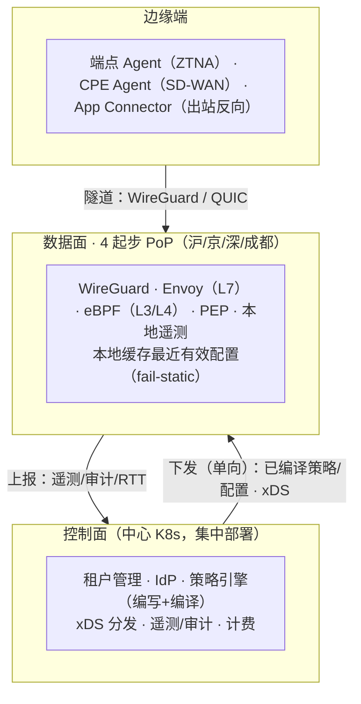
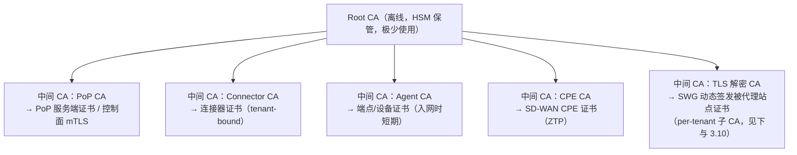
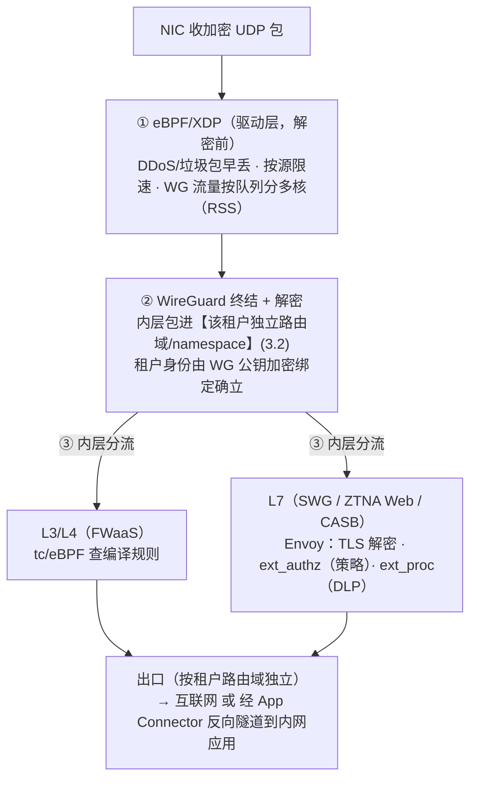

# 多租户 SASE 系统 · 架构设计文档

> **状态:** 详细设计 / L2 已成体系并进入编码
> **版本:** v0.6
> **日期:** 2026-05-27
> **设计者:** 花刚 <ghua@ikuai8.com>
>
> **说明:** 逐节遵循「背景 → 目标 → 设计 → 风险 → 结论」。量化指标标注「待确认」者为建议初值,需业务方核定;标注「待实测」者需在选定环境验证。
> **v0.6(2026-05-27,Slices 15–25 as-built + 决策累积回写):** ① **SD-WAN 数据面隧道形态修正**(3.7/R7、附录 B):由「TLCP/铜锁(TLS 流隧道)」改为「**自研 crypto-agile UDP 数据报隧道**(ChaCha20-Poly1305↔SM4-GCM 可插拔)」,握手用 **TLS1.3/TLCP 导出密钥**(见 `sase-l2-data-plane-tunnel.md` v0.2 / `sase-l2-tunnel-handshake.md`)——**国密算法栈不变,变的是封装形态**;ZTNA 数据面仍 L7、管理面/控制信令面仍 TLCP(gm-crypto 3.8)不变;**全文 WireGuard 表述就 SD-WAN 数据面而言以该 L2 为准**。② 自定义 xDS 资源 4→6 类(3.1/3.11:+`FWRuleSet`/`DLPRuleSet`)。③ 控制面新增第 7 业务模块 **risk** 信任/风险引擎(3.8)。④ 三项安全能力 SWG/FWaaS/CASB-DLP 已全部 as-built(5.2)。⑤ 遥测管道(单元③)DLP→风险闭环 + 角色化 PKI W11(3.5/3.14)。⑥ ZTP 入网/续期/撤销 + revtunnel 租户绑定 W9(3.5/3.11)。⑦ 审计事务化 DB 触发器设计(3.14)。⑧ 补 5.2 as-built(Slices 15–25)。详见各 L2。
> **v0.5(2026-05-26,由国密 PoC-G 通过触发的累积回写):** 并入 backlog W1–W3、W5–W8(**W4 属 gm-crypto 文档项、不涉 L1;W9 revtunnel↔证书绑定为代码加固项、待 ZTP 那刀**)—— W1 `PolicyBundle.content_hash`(3.3)、W2 国密 PoC-G 结论(R7/3.7:隧道 TLCP/铜锁、SM4 需硬件加速 C-G1、SM2≈Ed25519、crypto-agility 已码)、W3 `TrustBundle` 自定义资源(3.1/3.11)、W5 CPE 入网协议(3.11)、W6 PoC-1 隔离两条硬要求(3.7:per-tenant 表 `unreachable default` + Envoy `CAP_NET_ADMIN`,由设计目标转已证明)、W7 posture 口径统一为 subject 选择器 + 扩至 8 项(3.8)、W8 撤销三层口径统一(3.8);并补 5.2 as-built 现状(Slices 0–14)。
> **v0.4:** 并入评审 2026-05-24 决策(国密必须、客群画像、起步上云、附录 B.1 多数 C 项核定);见 `docs/reviews/sase-arch-review-2026-05-24.md`。
> **仍开放项:** C10 拐点输入、C11 带宽报价、M1–M4 规模化待实测、PoC-G M-G3~M-G5(部分待国密 CPU)、PoC-1 的 TPROXY/规模。
>
> **全局前提(评审 2026-05-24 已定):**
> - **服务区域:** 中国大陆,无海外客户;跨境合规与选路本期不纳入(C1)。
> - **目标客群:** 以**金融 / 政企 / 央国企 / 网络科技公司**等**强合规**客户为主 → 等保三级及该类客户强制国密,故 **R7 国密已定为必须支持**;客户可能分布全国 → PoP 选址采用「需求驱动、可快速增删」策略,起步覆盖三大城市群 + 西南(沪/京/深/成都),详见 2.2 与 3.13。
> - **部署形态:** 数据面**起步全部上云**(按量 + 弹性),**不自建机房**;某 PoP 持续流量过拐点后再评估自建 BGP(3.7,C10 拐点输入待填)。
> - **轨道优先级:** 远程/移动办公为主 → **ZTNA(P1)先行**,SD-WAN(P3)紧随;首批客户以多分支为主时 P1/P3 可对调(3.22)。
>
> **文档层级与范围(重要):** 本文档是 **系统/解决方案架构(L1)**——定义组件构成、边界、组件间契约与横切关注点(多租户/PKI/部署/安全等)。**不包含各交付物的内部软件架构(L2)**:服务端(控制面)内部分层/包结构、前端(控制台)架构、客户端(Agent/Connector/CPE)内部模块、PoP 单机内部编排。L2 各组件详细设计为**独立文档**;**v0.5 现状:L2 已成体系并进入编码(Slices 0–14,见 5.2)**。其中 **R7 国密已定为必须**,直接约束 L2 客户端/PoP 加密栈设计,国密选型结论已产出(见 R7/3.7);**共享 Envoy 隔离 PoC-1 核心已验证**(两条硬要求坐实,见 3.7;余 TPROXY 下行/规模待续)。

---

## 目录

- 一、背景
- 二、目标
- 三、设计
  - 3.1 整体架构
  - 3.2 多租户隔离
  - 3.3 数据模型
  - 3.4 控制面(统一底座)
  - 3.5 PKI 与密钥管理
  - 3.6 网络寻址与 DNS
  - 3.7 数据面与硬件成本
  - 3.8 轨道一:ZTNA
  - 3.9 轨道二:SD-WAN
  - 3.10 安全栈:SWG / FWaaS / CASB-DLP
  - 3.11 API 与协议契约
  - 3.12 平台自身安全与威胁模型
  - 3.13 部署与选址
  - 3.14 可观测性
  - 3.15 容灾与备份
  - 3.16 租户生命周期
  - 3.17 计费与计量
  - 3.18 管理控制台与 RBAC
  - 3.19 性能预算
  - 3.20 测试策略
  - 3.21 技术选型汇总
  - 3.22 路线图与里程碑
- 四、风险
- 五、结论
- 附录 A:术语表
- 附录 B:待确认 / 待实测 / PoC 项汇总清单

---

## 一、背景

爱快(iKuai)长期深耕企业网络设备与软路由领域,有网络接入与组网的技术与渠道积累。随着客户应用上云、远程与多分支办公常态化,传统「以总部为中心 + 分散安全设备」的模式难以为继。本项目在此基础上向 SASE(安全访问服务边缘)延伸——把网络接入与安全能力融合、以多租户 SaaS 形式对外交付,面向中国大陆 50–5000 人中大型企业。

### 1.1 现状与痛点

目标客户(50–5000 人企业)当前普遍采用「VPN + 专线 + 分散安全设备」组合,存在四类可观测问题:

1. **VPN 网关成远程办公瓶颈,且授信过度。** VPN 把用户接入后放进网段,默认可达段内多数主机;账号/设备被攻陷后可横向移动。全员远程后,集中网关的加解密与会话表成容量与单点瓶颈。
2. **云应用流量绕行(hairpinning),延迟被物理路径放大。** 用户→VPN 回总部→出口→公有云再原路返回;延迟由光速下限决定,只能靠就近出口消除,不能靠软件优化。
3. **多站点 MPLS 专线成本高、开通周级。** 专线单价远高于普通宽带,新站点开通以周计。
4. **安全策略分散在各设备,缺租户级统一管理。** 防火墙/代理/过滤分布在不同品牌设备,策略不一致、审计困难。

### 1.2 为什么做成对外多租户 SaaS

目标客户多无力自建并运营全球边缘网络(全球 PoP、7×24 安全运营、威胁情报);SaaS 订阅把固定成本摊薄到多租户,客户按用户/带宽付费、无 capex。产品服务多个**互不信任**的客户企业,故多租户隔离是第一约束(3.2)。

### 1.3 SASE 的两条接入轨道(范围基础)

| 轨道 | 解决 | 连接对象 | 端侧形态 |
|------|------|---------|---------|
| 人(ZTNA,替代 VPN) | 远程用户安全访问应用 | 用户/设备 ↔ 应用 | 软件 Agent |
| 站点(SD-WAN) | 多分支组网与选路 | 站点 ↔ 站点 | CPE(设备/虚拟机) |

两条轨道流量汇入同一套 PoP 数据面,叠加统一安全栈(SWG/FWaaS/CASB-DLP)。这是「地基统一、能力分期」的基础。

---

## 二、目标

### 2.1 业务目标

1. 对外多租户 SASE 服务,覆盖两条接入轨道 + 基础安全栈(分期)。
2. 客户自助开通、按租户计费、按租户独立配置策略与身份源。

### 2.2 技术目标(量化指标:评审 2026-05-24 已核定;标注「待实测」者仍需选定环境验证)

| 指标 | 取值 | 依据 |
|------|------|------|
| 用户到最近 PoP 接入延迟(**分级,见下注**) | 覆盖区 P95 < 30 ms;非覆盖区尽力而为(**已定:不承诺 30ms**) | 30ms 仅对**覆盖区**成立:起步 4 PoP(沪/京/深/成都)半径约 500km 内(三大城市群 + 成渝)。**东北、西北、偏远地区**到最近 PoP 物理距离过远,受光速下限约束(1.1)无法达 30ms,列为**非覆盖区**:尽力而为 + 实测 RTT 触发按需加 PoP(3.13),**不对其承诺 30ms**。拆解见 3.19 |
| 单 PoP 数据面吞吐 | 单节点 ≥ 10 Gbps(待实测 M1) | 16–32 核 x86 + ConnectX-6/E810 + 多队列 RSS 下属可达量级(ChaCha20 ~2–4 Gbps/核);需选定型号实测(3.7)。**注:承载国密租户的 PoP 须带 SM4 硬件加速(C-G1,3.7),否则 SM4 软件吞吐暴跌 6×+;带加速 SM4 上限待国密 CPU 复测(M-G3~M-G5)** |
| 单租户最大用户数 | ≥ 5000 | 与目标客户规模上限对齐 |
| 控制面 API 可用性 | 99.9%(年停机 ≤ 8.76h) | 控制面不在流量热路径(3.1) |
| 数据面可用性 | 99.99%(年停机 ≤ 52.6min) | 数据面在热路径,靠多 PoP + 无状态(3.13) |
| 跨租户数据/流量泄漏 | 0(硬性) | 多租户 SaaS 不可妥协约束(3.2) |
| 新站点零接触开通耗时 | < 30 min | 相对 MPLS 周级的可量化卖点(3.9) |

### 2.3 范围与非目标

**首期范围(P0–P5,见 3.22)**:统一底座、ZTNA、SWG、SD-WAN、FWaaS、CASB/DLP。

**非目标(本期不做)**:端点 EDR/杀毒;邮件安全网关;自建物理骨干(P0 租用公有云/IDC 互联);起步不自建机房(用云 BGP 多线区域,规模化后评估,3.7);自研**密码学原语 / 密钥协商**(**v0.6 明确边界**:SD-WAN 数据面采自研 **封装格式**——crypto-agile UDP 数据报隧道,但**密码学全用标准件**:AEAD 用 SM4-GCM/ChaCha20-Poly1305,**握手用 TLS1.3/TLCP 导出密钥、零自研密钥协商**,见 3.7/R7 + `sase-l2-tunnel-handshake.md`;ZTNA 复用 Envoy L7/TLS。即"自研报文封装、不自研密码学",仍待密码学审查)。

---

## 三、设计

### 3.1 整体架构:控制面 / 数据面分离

**背景** 需同时承载两条轨道 + 安全栈,服务全国多租户,数据面在每包热路径。须让"快而不可靠的转发"与"慢而需一致的策略管理"解耦。

**目标** 数据面故障域最小化(控制面挂不断流);数据面按 PoP 水平扩展,控制面集中且可用性可低于数据面;配置可版本化/回滚/灰度。

**设计**



三条关键决策:
1. **控制面/数据面分离。** 依据:数据面每包热路径需 99.99% + 水平扩展;控制面只产"意图"、不碰流量,可集中、可用性更低。落地:控制面中心 K8s,PoP 经 gRPC 长连订阅配置。
2. **配置分发复用 xDS 传输机制;区分"标准 Envoy 资源"与"自定义资源"。** 依据:xDS 的传输层(gRPC streaming + 版本 + ACK/NACK + 增量)自带一致性语义,支撑数千节点;备选自建消息总线需自造这些,落选。落地两层界定清楚:
   - **Envoy** 消费**标准 Envoy xDS 资源**(LDS/RDS/CDS/EDS 等),这是 Envoy 专有 schema。
   - **非 Envoy 组件**(PoP-agent 管理的 WireGuard peer、eBPF 规则、吊销表、租户路由域、**会话凭证验证公钥 `TrustBundle`**)**复用 xDS 的传输机制**,但承载的是**自定义资源类型(custom type URL),不是标准 Envoy 资源**——即"同一套 gRPC streaming/版本/ACK 协议,自定义 payload"。契约见 3.11。
   > v0.6 实现现状:as-built 已落地的自定义资源 **6 类**:`L7PolicyBundle`(策略,eBPF 规则的 L7 部分)、`RevocationList`(吊销)、`SWGRuleSet`(SWG)、`FWRuleSet`(FWaaS L3/L4)、`DLPRuleSet`(CASB-DLP)、`SiteConfig`(SD-WAN 站点),经 go-control-plane 的 ADS+Delta+MuxCache 分类下发(撤销/各能力走独立流);`TrustBundle`/`L34RuleSet`/`WGPeerSet` 待后续刀。注:本节括号列 5 项(WG peer、eBPF 规则、吊销表、租户路由域、TrustBundle),与 3.11 一致;eBPF 规则在 L2 细化为 `L34RuleSet`+`L7PolicyBundle`,`TrustBundle` 为新增——属细化+新增,非计数不一致。**「加能力不加基础设施」:三项安全能力(SWG/FWaaS/CASB-DLP)各新增一类资源,复用同一 xDS 传输底座,不新增分发设施(5.2)。**
   > 措辞约定:下文"xDS 分发/经 xDS 下发"指**复用该传输机制**;只有明确写"标准 Envoy 资源"时才指 LDS/RDS/CDS/EDS。
3. **PoP 对持久数据无状态;租户策略是下发配置而非本地库。** 依据:任一 PoP 经认证可服务任一租户用户 → 支撑 RTT 就近接入(3.13)与跨 PoP 切换。

**fail-static(显式定义,有安全含义):** 控制面不可达时 PoP 用缓存配置继续执行,不接受新策略;但**用户/设备撤销不能等控制面恢复**——撤销走独立快速失效通道(短 TTL 凭证 + 吊销表 xDS 推送,见 3.5/3.8)。

**风险** xDS 超大规模节点的推送延迟/内存(起步无压力,规模化待实测);fail-static 配置陈旧窗口 → 短 TTL 凭证压到分钟级。

**结论** 控制面/数据面分离 + xDS 统一分发 + 无状态 PoP + 显式 fail-static(撤销走独立快速通道)。

---

### 3.2 多租户隔离 ⭐(最关键约束)

**背景** 对外 SaaS 服务互不信任租户,2.2 定"跨租户泄漏 = 0"硬性。隔离覆盖控制面数据、数据面流量、身份绑定,并解决吵闹邻居。

**目标(可衡量)** 任一租户无法读取/影响他租户配置与数据(0 泄漏);流量无法路由到达他租户网络域;单租户资源不拖垮同 PoP 其他租户。

**设计 —— 三层隔离**

**第 1 层 控制面数据隔离 → 共享 schema + Postgres 行级安全(RLS)(已确认)**
- 备选:库分租(隔离最强,但上千租户迁移×N、连接池爆炸,不可持续)、schema 分租(居中)。**租户量级已确认几十–上千**,共享 schema + RLS 是唯一可持续选项;隔离在 DB 引擎层强制,应用 bug 也不越权(纵深防御)。
- 落地:每表带 `tenant_id`;每事务 `SET app.current_tenant=<id>`;RLS `USING (tenant_id = current_setting('app.current_tenant')::uuid)`;连接池归还时必须重置该设置(风险见下)。
- 逃生通道:超大租户后续迁独立库(`tenant_id` 模型使其为数据迁移而非 schema 改造)。
- 数据加密:每租户独立数据密钥(KMS 信封加密,见 3.5),限爆炸半径、支持密钥销毁式删除(3.16)。

**第 2 层 数据面流量隔离 → 每租户独立路由域 + 加密绑定标签(已确认,最关键)**
- 备选:软件标签法(共享接口 + 包内标记,开销低但一个 bug=泄漏)。**选用每租户独立 network namespace + 独立 WireGuard 接口 + 独立路由表(VRF 式)**,L3 隔离由内核强制(已确认"强隔离优先于省开销")。开销:每 PoP 仅为该 PoP 有活跃用户的租户创建,数量有界。
- 落地:租户身份由 WireGuard 公钥/连接器身份在入口推导(加密绑定、不可伪造),不依赖可篡改报文头;各路由域间无路由可达,出口按域独立;租户标签随流量传入 Envoy 用于 L7 策略(共享 Envoy 如何接入各租户 namespace、出口如何经 `SO_MARK`+策略路由保持隔离,见 3.7)。

**第 3 层 身份与租户绑定** 隧道密钥、证书、连接器注册在签发时绑 `tenant_id`(3.5);用户认证只走该租户配置 IdP,令牌不跨租户。

**配额与吵闹邻居** 每租户上限:并发连接、带宽、策略条数、连接器数。落地:带宽在 PoP 用 tc/eBPF 按租户路由域限速;计数在控制面校验。依据:5000 人租户不得饿死 50 人租户。

**遥测/日志隔离** 全部按 `tenant_id` 打标分区,租户管理员只见本租户数据(3.14/3.18)。

**风险** ① 新增表漏配 RLS → CI 强制每张含 `tenant_id` 表启用 RLS,缺失则构建失败;② 连接池跨租户串号 → 归还连接重置上下文 + 集成测试;③ 单 PoP 租户 namespace 数量上限(Linux 支持数万,起步无压力,规模化待实测)。

**结论** 三层隔离:RLS + 每租户信封加密(控制面);内核强制每租户路由域 + 加密绑定标签(数据面);IdP 绑定身份。配额防吵闹邻居;两个泄漏点用 CI/测试堵死。

---

### 3.3 数据模型

**背景** 控制面所有功能的地基。前面反复引用 `tenant_id`/策略/应用/连接器,本节给出实体模型与关系。

**目标** 定义核心实体、字段要点、关系与租户作用域;所有业务表带 `tenant_id` 并受 RLS(3.2)。

**设计 —— 核心实体(Postgres)**

```
Tenant(租户)
  id, name, status(active/suspended/offboarding), plan, created_at
  ─< IdPConfig(身份源配置)
       id, tenant_id, type(oidc/saml/wecom/dingtalk/feishu), client_id, secret_ref(→KMS), domain
  ─< User(用户)         id, tenant_id, external_id(IdP侧), email, group_ids[], status
  ─< Group(组)          id, tenant_id, name, source(scim/idp)
  ─< Device(设备)       id, tenant_id, user_id, platform, posture(jsonb), cert_serial, last_seen
  ─< Application(ZTNA应用) id, tenant_id, name, fqdn/overlay_ip, protocol, connector_group_id
  ─< ConnectorGroup     id, tenant_id, name        ─< Connector  id, group_id, cert_serial, status, last_seen
  ─< Site(SD-WAN站点)   id, tenant_id, name, location ─< CPE  id, site_id, cert_serial, wan_links(jsonb), status
  ─< Policy(策略)       id, tenant_id, subject(user/group/device-posture), resource(app/segment),
                          action, condition(time/geo/risk, jsonb), effect(allow/deny/inspect), priority
  ─< PolicyBundle(编译产物) id, tenant_id, version, content_hash, compiled(bytea), created_at, status(active/rolled_back)
  ─< Quota              tenant_id, max_conns, max_bandwidth_mbps, max_policies, max_connectors
  ─< AuditLog           id, tenant_id, actor, action, target, ts, detail(jsonb)
  ─< UsageRecord        id, tenant_id, metric(bytes/seats/...), value, window_start, window_end

PoP(平台级,非租户作用域)  id, region, bgp_ips[], nodes[], status
```

要点:① 除 PoP 等平台级表外,所有表带 `tenant_id` + RLS;② 秘密(IdP secret、密钥)不入库明文,只存 KMS 引用 `secret_ref`(3.5);③ 策略编写态(`Policy`)与执行态(`PolicyBundle` 编译产物、带版本)分离,支撑回滚(3.1/3.4);`PolicyBundle.content_hash`(对 `compiled` 取哈希)用于幂等:内容未变不产新版、不下发(v0.5 并入,源策略编译器 L2 3.7);④ 设备姿态、WAN 链路等半结构化字段用 `jsonb`。

**风险** schema 演进需迁移工具(含 RLS 检查,3.2);`jsonb` 字段缺约束 → 应用层 + 校验兜底。

**结论** 实体围绕 `Tenant` 展开、全表 RLS、秘密只存引用、策略编写态/执行态分离。

---

### 3.4 控制面(统一底座,Phase 0)

**背景** 两条轨道 + 安全能力共用的控制面,P0 先于一切交付。提供租户管理、身份对接、策略引擎、配置分发(xDS,3.1)、遥测/审计。

**目标** 明确服务边界,避免起步过度微服务化;打通策略「编写→编译→下发→执行」;IdP 覆盖中国企业现实。

**设计**

**服务划分:3 个单元,按负载特征切**

| 单元 | 职责 | 存储 | 为什么单独 |
|------|------|------|-----------|
| 控制面 API(模块化单体,Go) | 租户、身份、策略编写、计费、Admin API | Postgres(RLS) | 多 CRUD,进程内模块边界即可,起步不拆微服务 |
| 配置分发(xDS server,Go) | 持有到所有 PoP 的长连 gRPC 流,推送编译配置 | 无持久 | 长连流式负载与 CRUD 扩缩/可用性特征不同 |
| 遥测/审计管道 | 摄取流日志/审计/RTT,按租户存储查询 | VictoriaMetrics + ClickHouse(候选) | 高吞吐写入,与 API 隔离 |

依据:小团队 + Go,起步模块化单体,只独立"流式分发"与"高吞吐遥测"两个负载迥异单元;否决"P0 即十几个微服务"。

**IdP 对接** 标准 OIDC/SAML/SCIM + **企业微信/钉钉/飞书适配器(三个首批均纳入,已确认)**;依据:目标客群是中国企业。令牌模型:IdP 认证后控制面**自签短 TTL 凭证**(对接 3.1 fail-static、3.8 持续验证),不把 IdP 长令牌透给数据面。

**策略引擎(编写→编译→下发→执行,热路径无解释器)** 统一模型:`主体 × 资源 × 动作 × 条件 → 效果`(3.3 `Policy`)。两级执行:L3/L4 编译进 eBPF map(内核查表);L7 经 Envoy `ext_authz` 调本地 PEP 评估编译策略包。依据:每包跑解释器不可接受。版本化:编译成带版本包(3.3 `PolicyBundle`),经 xDS 下发、PoP ack,回滚=推上一版。

**遥测/审计** 按 `tenant_id` 打标;为 3.13 选址、3.8 持续验证供数据(详见 3.14)。

**风险** 模块化单体后续拆分依赖现在的模块边界 → 内部 API 边界 + 依赖检查;国产 IdP 适配器随其 API 变更有维护成本;策略编译错误=安全漏洞 → 策略测试框架 CI 强制(3.20)。

**结论** 控制面 3 单元(模块化单体 API + xDS + 遥测);IdP 覆盖标准 + 企业微信/钉钉/飞书;策略两级编译执行、版本化可回滚。

---

### 3.5 PKI 与密钥管理(安全产品命门)

**背景** 系统的信任根。隧道加密、连接器/Agent 身份、控制面 mTLS、租户数据加密全依赖它。CA/KEK 失守 = 全体租户沦陷,故需完整设计与威胁建模(配合 3.12)。

**目标** 定义 CA 层级、证书类型与生命周期(签发/轮换/吊销)、密钥管理(KMS/HSM)、租户数据加密与密钥销毁。

**设计**

**CA 层级**

依据:Root 离线 + 分用途中间 CA,单一中间 CA 失守可单独吊销/轮换,不动 Root,爆炸半径受限。

**证书生命周期**
- **签发**:Agent——用户经 IdP 认证 → 设备生成 CSR → 签发**短期证书(小时/天级)**;Connector/CPE——一次性激活码 + CSR → tenant-bound 证书。
- **轮换**:短期证书自动续期(对接持续验证 3.8);中间 CA 定期轮换(双签过渡);Root 极长周期 + 应急流程。
- **吊销**:**优先短 TTL 而非依赖 CRL/OCSP**(CRL 分发有延迟);应急吊销走**吊销表(xDS 传输机制承载的自定义资源,非标准 Envoy 资源)推送到 PoP**(快速失效通道,对接 3.1 fail-static)。依据:撤销实时性是零信任要求,短 TTL + 主动推送优于被动 CRL。

> **v0.6 as-built ——ZTP 入网与证书绑定(W9)+ 角色化 PKI(W11):**
> - **ZTP 全链路已码**(`internal/enroll` + `internal/devpki/csr.go`,Slices 15/16):激活码 `<tenant_uuid>.<random>`(一次性,租户前缀解 bootstrap RLS)→ 设备本地 `GenerateCSR`(私钥不离设备)→ CA `SignCSR` 把 tenant 编进证书 Organization → `Redeem` 签租户绑定证书;`Renew`(当前 mTLS 证书认证 + 密钥轮换、`CertRotator` 热轮换)、`RevokeDevice`(撤销闸 → renew 拒签 → 证书到期 → 有界时间撤销)。`/enroll`+`/renew` 经 `internal/ratelimit` 令牌桶防枚举/暴力,`enroll.WithAudit` 单独留痕。
> - **W9 revtunnel↔证书绑定:** `revtunnel.register` 校验 `Hello.Tenant ⊆ 证书租户`,生产 fail-closed(`SASE_REQUIRE_CERT_TENANT=1` 必设);`CONN_MAX_AGE` 连接限活强制周期重握手使续期/撤销对长连接生效。
> - **W11 角色化 PKI:** 证书 Subject **OU 编入角色**(`role:pop`/`role:device`),与 tenant-in-Organization(W9)**正交**;PoP 是多租户基础设施(tenant 不能绑证书,信任 = 信 PoP 角色),遥测/上报类端点据角色门控(3.14)。`devpki` 已按角色拆分签发(`SignPoP`/`signClient`)。

**密钥管理(KMS/HSM)**
- 租户数据:**信封加密**——每租户数据密钥 DEK,被 KEK 包裹,KEK 存 KMS/HSM。读写时解包 DEK。
- **密钥销毁式删除**:租户注销删除其 DEK → 数据不可恢复(3.16,满足 PIPL 删除权)。
- WireGuard 密钥:**私钥在各端点(Agent/PoP/连接器)本地生成,永不离开设备**;只把**公钥**注册到控制面(经 mTLS),控制面据此把对端**公钥**作为 peer 配置经 xDS 分发给相关 PoP/端点(私钥不分发)。租户间公钥空间独立,一个租户公钥泄露不波及他租户。与本节证书的"设备生成 CSR"一致——控制面只见公钥,不接触任何私钥。
- **TLS 解密 CA 私钥(SWG 命门)**:SWG 动态签发被代理站点证书需在线持有签名私钥,**这是高价值目标**。约束:① **per-tenant(或 per-tenant-per-PoP)子 CA**,租户级隔离——一个租户的解密 CA 泄露不波及他租户,也不波及主 PKI(它是独立中间 CA,不能签其他用途证书);② 私钥存 **HSM / 软 HSM / 受保护密钥区(如 enclave/KMS 不可导出密钥)**,**不以明文驻留 PoP 磁盘**;③ 短有效期 + 定期轮换 + 可独立吊销;④ 仅签发"被代理站点"叶子证书,**优先基于策略白名单限制签发范围;Name Constraints 仅在域名集合可预定义时使用**(代理通用互联网访问时需动态签大量公网域名,无法预定义 Name Constraints;仅对白名单 SaaS 解密时 Name Constraints 才成立)。**PoP 被攻陷的解密爆炸半径由此限定在该 PoP 服务的租户,且密钥若在 HSM 不可导出则进一步收窄**(对接 3.12)。
- Root CA 私钥与 KEK 用 **HSM**;敏感操作(Root 签发、KEK 管理)**双人控制(dual-control)**。

**国密合规(R7,已定:必须支持)** 目标客群以金融/政企/央国企/网络科技公司为主,等保三级强制国密 → **证书体系须支持国密**:SM2 签名算法 + SM3 摘要(替代/并行 RSA·ECDSA + SHA-256),CA 层级各级证书与签发链相应改造;HSM 须选支持 SM2/SM3 的型号(或软 HSM 国密实现)。TLS 解密链路的国密版 TLS 见 3.10。**具体算法套件、双证书(签名+加密)体系、与国际算法的并行/择一策略,由派生 P0 设计任务「国密 PKI 选型」给出(见 R7);本节先锁定"证书体系必须支持国密"。**

**风险** ① KEK 丢失 = 全租户数据不可恢复 → HSM 备份 + 密钥托管流程(3.15);② 证书签发被滥用 → 签发需 IdP 认证/激活码 + 审计 + 速率限制;③ Agent 私钥泄露 → 短期证书限窗口 + 设备绑定 + 可吊销;④ **国密 HSM/库选型不当致性能或合规缺口 → 纳入 P0 国密选型与实测(R7)**。

**结论** Root 离线 + 分用途中间 CA;短期证书 + 吊销表(走 xDS 传输机制的自定义资源,非 CRL);每租户 DEK 信封加密支持密钥销毁式删除;Root/KEK 入 HSM 且双人控制。**贯穿原则:端侧身份私钥与 WireGuard 私钥在端点本地生成、永不离开设备,控制面只接触公钥/CSR;CA/KEK 类平台根密钥(含需在线签名的 TLS 解密子 CA)由 HSM/KMS 管理、不可明文导出。** 两类密钥不混淆:端侧密钥强调"不离开设备",平台根密钥强调"受 HSM/KMS 保护、可在其内签名但不导出"。

---

### 3.6 网络寻址与 DNS

**背景** ZTNA 要回答"用户怎么解析并路由到内网应用 `app.tenant.internal`",SD-WAN 要回答站点 overlay 寻址。前面未涉及,是能否跑通的硬细节。

**目标** 定义租户 overlay 地址规划、ZTNA 应用寻址与 split-DNS、连接器侧解析。

**设计**

**租户 overlay 地址** 每租户在**独立路由域**(3.2),故**地址空间可复用不冲突**(租户 A、B 都可用 `100.64.0.0/10` 或 RFC1918,内核路由域隔离)。依据:复用避免地址规划爆炸,隔离由 3.2 保证。
> ⚠️ 关联点:地址复用 + **共享 Envoy**(3.7 方案 B)叠加时,Envoy 对"哪个租户的 `100.64.1.5`"的消歧**完全依赖 per-tenant 路由表/`SO_MARK`**。这正是 3.7 列为 **P0 PoC 必须证明**的隔离语义之一,在此显式标注关联。

**ZTNA 应用寻址与 split-DNS**
- 应用以 FQDN(如 `crm.acme.internal`)或分配的 overlay IP 标识(3.3 `Application`)。
- 端点 Agent 接管**租户内部域名**的 DNS:解析 `*.acme.internal` → 返回 overlay IP → 流量进隧道到 PoP → 经连接器到真实应用。公网域名正常解析(或经 SWG,3.10)。
- Agent 入网时从控制面拉取:租户内部域名列表 + 应用→连接器映射 + split-tunnel 规则(3.8/3.11)。

**连接器侧** 连接器在客户网络内解析应用真实地址(内网 DNS/IP),对 PoP 屏蔽内网拓扑。

**SD-WAN 站点寻址** 各站点子网经 CPE 在租户路由域内互通;PoP 骨干转发(3.9)。

**风险** 租户内部域名与公网域名冲突(如客户用真实域名做内网)→ Agent split-DNS 按租户配置的内部域名精确匹配;overlay IP 与客户本地网段冲突 → 用 CGNAT 段 + 可配置。

**结论** 租户路由域隔离使 overlay 地址可复用;Agent split-DNS 接管内部域名解析到 overlay IP 经连接器访问;连接器屏蔽内网拓扑。

---

### 3.7 数据面与硬件成本

**背景** 数据面每包热路径,要 99.99% 与 ≥10Gbps/PoP(R2 待实测),R3 指出成本由带宽主导。

**目标** 定清三件套职责与顺序、硬件规格、带宽成本模型。

**设计 —— 三件套处理顺序(按包生命周期)**

顺序依据:加密包先经 XDP 早丢(省解密 CPU),WireGuard 解密后才见内层、才谈 L3/L4 与 L7;隔离在"解密入域"时由内核建立。

**国密合规对数据面隧道的影响(R7,已定:必须支持)** WireGuard 固定用 ChaCha20-Poly1305 + Curve25519 + BLAKE2s(Noise 框架),**不支持国密 SM2/SM3/SM4**——这是国密落地的最大难点。三条候选,P0 选型期评估并出结论(备选与落选理由见 R7):

| 候选 | 说明 | 主要代价 |
|------|------|---------|
| ① WireGuard 国密化 | SM4 替 ChaCha20、握手改 SM2/SM3,改 Noise 框架 | 偏离上游、自维护分支、密码学审查成本;吞吐须按 SM4 重测(SM4 无类 ChaCha20 的免 AES-NI 优势) |
| ② 国标 IPsec/SSL VPN | 改用 IKEv2 国密套件 或 GB/T 国标 SSL VPN | 弃 WireGuard 简洁性,IPsec 复杂度与运维包袱回归 |
| ③ 国密 TLS 隧道 | 数据面隧道走国密版 TLS(铜锁 tongsuo / GmSSL) | 隧道开销高于 WireGuard,需评估热路径性能 |

**国密选型结论(v0.5 并入,源 `docs/sase-gm-crypto-selection.md` v0.3 + PoC-G):** ① **隧道选 ③ 国密 TLS(TLCP/铜锁双栈)**,**① WireGuard 国密化落选**(偏离上游 + SM4 无 ChaCha20 的免硬件优势);SM2 PKI、SM3、铜锁-Envoy。② **PoC-G 实测(`poc/pocG-gmcrypto/RESULT.md`)**:M-G1——无 SM4 加速的 x86(Broadwell/AVX2)上 SM4≈0.75–0.8 Gbps/核(OpenSSL=铜锁,gmsm AVX2 软件 1.89 Gbps),仍慢 AES-NI 6× / ChaCha20 4×;M-G2——**SM2 签名 ≈ Ed25519(凭证/PKI 无性能顾虑);crypto-agility 已在代码验证**(`internal/cred` 算法可插拔 Ed25519↔SM2,契约不变)。③ **C-G1 升为硬性部署要求:承载国密租户的 PoP CPU 必须带 SM4 加速(AVX-512+GFNI 或专用 SM4 指令)**——否则国密隧道吞吐暴跌 6×+,直接恶化单位经济性(5.1)。**M-G3~M-G5(铜锁-Envoy / TLCP 握手 / 数据面真换 SM4)待续。**

> **v0.6 修正 ——SD-WAN 数据面隧道形态(以 L2 为准):** 上表 ③「国密 TLS 隧道」原指 **TLS 记录层流隧道**(TLCP/铜锁直接承载数据面)。**进入 L2 详设后形态收敛为「自研 crypto-agile UDP 数据报隧道」**(`internal/dptunnel`):AEAD 数据报(`ChaCha20-Poly1305`↔`SM4-GCM` 可插拔)+ 计数器重放窗口 + 块状 FEC,**握手用 TLS1.3 / TLCP-铜锁导出密钥(零自研密钥协商,待密码学审查)**,而非用 TLS 记录层承载流量。**与上表三候选的关系:既非 ①(不 fork WireGuard/Noise),亦非 ③ 的「TLS 流隧道」语义(数据报而非记录层流);国密算法栈(SM4-GCM / SM2 握手 / SM3)与 C-G1 硬件要求不变,变的只是封装形态**——数据报形态契合 SD-WAN 多链路/FEC/亚秒切换(`linkmon`),避免 TCP-over-TLS 的队头阻塞。详见 `docs/sase-l2-data-plane-tunnel.md` v0.2 + `docs/sase-l2-tunnel-handshake.md`(形态 A,花刚已认可)。**ZTNA 数据面保持 L7(Envoy,不走此隧道);管理面 / 控制信令面仍 TLCP(gm-crypto 3.8)。本文余处 WireGuard / 「TLCP 流隧道」表述,就 SD-WAN 数据面而言均以该 L2 为准。**

**Envoy 与租户 namespace 的连接方式(此前未明确,关键落地点)**

问题:3.2 定了"每租户独立 namespace/路由域",L7 走 Envoy,但 Envoy 与租户 namespace 的关系有三种可能,直接决定能否扛上千租户。

| 方案 | 说明 | 取舍 |
|------|------|------|
| A. 每租户一个 Envoy 实例 | 每个租户 namespace 内独立 Envoy 进程 | 隔离最强(进程+namespace),但 Envoy 单实例基线内存数十~上百 MB + 各持一条 xDS 流;**上千租户 = 上千进程 + xDS 连接爆炸,内存与控制面连接不可承受**。低流量租户尤其浪费 |
| B. 共享 Envoy + 内核机制保持租户隔离 | 一个(或一组)Envoy 承载多租户,经 socket mark + 策略路由保证每条上游连接落在正确租户路由域 | **可扩展到上千租户**(内存/连接共享),复用 Envoy 生态;L7 隔离依赖配置正确性(略弱),**目标是在 P0 PoC 验证后,由 L3/namespace 提供兜底**(纵深防御,详见下方机制第 4 点) |
| C. 每租户 namespace 内放轻量 L7 proxy | 用自研轻量代理替代 Envoy | 仍是 N 进程开销;且要重写 `ext_authz`/`ext_proc`/TLS/xDS,**与 Envoy 选型(3.10)冲突,重建成本过高**,落选 |

**决策:默认方案 B(共享 Envoy),超大/高隔离租户用方案 A 作逃生通道**——与 3.2 "超大租户迁独立库" 的逃生通道哲学一致。

方案 B 的具体机制:
1. **承载**:每 PoP 一个(或一组)Envoy,多租户配置经 xDS 以 `tenant_id` 命名空间化(per-tenant listener/route/cluster);租户身份在 WG 入口由公钥加密绑定确立(3.2),作为连接元数据带入 Envoy 选择该租户的 L7 配置。
2. **流量进入**:解密后需 L7 处理的流量经 **TPROXY / ORIGINAL_DST 透明重定向**到共享 Envoy,租户标识由其来源 WG 接口/标记推导。
3. **出口隔离(关键)**:Envoy 发起上游连接(到连接器/互联网)时,按租户设置 **`SO_MARK`(socket option)**,配合 **`ip rule` 策略路由**选择**该租户的路由表**,使每条上游连接从正确租户域发出。
   > ⚠️ 注意:`SO_MARK` + `ip rule` 是**同一 network namespace 内**的策略路由,**不会天然"跳进"另一个 namespace**。若租户隔离用独立 namespace,则跨域还需 **VRF + veth 对 + per-tenant routing table + TPROXY** 一起接线;`SO_MARK` 只解决"选哪张路由表",不解决"进哪个 namespace"。**最终隔离语义以 P0 PoC 验证为准**(见下),本节只确定方向。
4. **兜底(PoC-1 已证明,2026-05-25)**:P0 PoC-1(Phase1 路由层 + Phase2 真实 Envoy)已验证,并坐实**两条硬要求**:① **per-tenant 路由表必须带 `unreachable default`**——否则 `SO_MARK` 命中后 fall-through 落 main 表跨租户够到他租户(已复现泄漏);加 `unreachable default` 即封死,且复用地址消歧不受损;② **共享 Envoy 进程必须持 `CAP_NET_ADMIN`**——否则打 `SO_MARK` 静默 `EPERM`、出口全挂。满足此二者后,内核 namespace/路由域兜底成立(即便 Envoy L7 路由出错也不突破他租户网络,3.2)——由「设计目标」转为「已证明结论」。**两条硬要求纳入 3.20 隔离测试门禁;未覆盖:TPROXY 下行透明入流、namespace 规模/perf(M 项)。来源 `poc/poc1-isolation/RESULT.md`。**

> 落地细节(共享 Envoy 与各租户 namespace 的具体 VRF/veth/per-tenant routing table/TPROXY/`SO_MARK` 接线,及"选路表"与"进 namespace"两件事如何协同)在 **P0 用 PoC 验证**(纳入 3.20 隔离测试)。本节确定方向与隔离目标,**具体隔离语义以 PoC 验证为准**。

**硬件规格(规模化自建)**

| 部件 | 规格 | 依据 |
|------|------|------|
| CPU | EPYC/Xeon 16–32 核 | ChaCha20-Poly1305 ~2–4 Gbps/核,10Gbps 需 4–8 核 + 多队列;ChaCha20 不依赖 AES-NI |
| 网卡 | ConnectX-6(25GbE)/ Intel E810 | 原生 XDP、多队列 RSS 成熟 |
| 内存 | 64–128 GB | 连接表 + 会话状态 |
| 整机 | 2U x86,约数万元/台 | 单台远超 10Gbps,水平扩展 |

> **国密 PoP CPU 硬要求(C-G1,v0.5):** 承载国密租户的 PoP,CPU 必须带 **SM4 硬件加速(AVX-512+GFNI,如 Intel Ice Lake+/Sapphire Rapids、AMD Zen4+;或专用 SM4 指令,如海光/兆芯、ARMv8.4)**;否则 SM4 软件吞吐仅 ~0.8–1.9 Gbps/核(PoC-G M-G1),承载暴跌。非国密租户无此约束。

**带宽成本模型(R3 量化,单位经济性核心)** 单 PoP 持续 1 Gbps(数字为量级,**需厂商报价复核**):

| 计费 | 估算 | 说明 |
|------|------|------|
| 云·按流量(~0.8 元/GB) | 1Gbps≈324TB/月≈**~26 万/月** | 持续高流量不可行 |
| 云·固定带宽(~50 元/Mbps/月) | 1000×50≈**~5 万/月** | 持续流量首选 |
| 自建 BGP 多线机房 | 批发单价显著更低 | 流量稳定后终态 |

决策:起步云 + 按量/弹性;某 PoP 持续流量过"云固定带宽=自建摊销"拐点时迁自建 BGP 机房(拐点=f(月流量,云单价,自建机柜+带宽+摊销),输入待填)。成本优化:对显式可信目的地按策略 split-tunnel 直连减带宽,**仅白名单、默认全检**。

**容量(C6 已定:人均 ~2 Mbps)** 人均 ~2 Mbps → 单 10Gbps PoP ≈ 5000 **并发**(把容量与带宽/人均吞吐显式挂钩)。注意口径:此 5000 是**单 PoP 全租户并发数**,与 2.2 "单租户最大注册用户 ≥5000" 不同维度——同一租户用户按 RTT 分散在 4 个 PoP 且非全员并发,故大租户不会占满单 PoP;真实承载以并发数 × 人均吞吐为准。

**风险** 10Gbps 待实测(R2);带宽主导单位经济性 → 定价须覆盖(5.1);split-tunnel 安全/成本取舍 → 白名单 + 默认全检。

**结论** 三件套按"XDP 早丢→WG 解密入域→eBPF/Envoy"分层;商用 x86 + ConnectX/E810,10Gbps 待实测;成本带宽主导,起步上云、拐点迁自建,split-tunnel 仅白名单。

---

### 3.8 轨道一:ZTNA(人,P1,替代 VPN)

**背景** 远程用户安全访问应用。替代 VPN 的差异:按应用授权(非网段)+ 应用零入站暴露。P1,验证整套底座。

**目标** 用户经身份+姿态验证后只能访问授权的**具体应用**(消除横向移动);应用对公网零入站暴露;撤销走 3.1 快速通道。

**设计**

| 组件 | 部署 | 职责 |
|------|------|------|
| 端点 Agent(Go 跨平台) | 用户设备 | RTT 选最近 PoP、建 WireGuard 隧道、上报姿态、执行 split-tunnel、split-DNS(3.6) |
| App Connector(Go) | 客户 VPC/机房 | 仅出站连 PoP、发布内网应用、应用零入站暴露 |
| Agentless | Envoy 身份感知反代 | 浏览器直访 Web 应用,供 BYOD/外包 |

**反向连接器协议(价值所在)** 连接器向外拨号到 PoP,建持久控制通道(mTLS)+ 数据隧道(QUIC);PoP 把授权用户流量导入连接器→应用。应用只见来自连接器(内网)的连接。依据:客户防火墙无需入站规则、应用无需公网 IP,攻击面大幅缩小。传输:数据面 QUIC(弱网友好、多路复用),被拦回退 TCP/443(`quic-go`)。协议契约见 3.11。

**访问决策流(每应用、可重评)** ①Agent 拦截→隧道到 PoP;②PEP 评估 身份(IdP 令牌)+姿态+应用策略+上下文→允许/拒绝;③允许→经连接器到应用,逐连接评估;④持续验证:分钟级短 TTL 凭证(3.5),姿态/风险变化即快速撤销,会话静默刷新。

**撤销三层(v0.5,as-built 已实现,源 ZTNA 硬化 L2 3.4):** ① **吊销表**经 xDS 独立流下发 PoP——PoP 权威切流(可达时秒级);② **终端实时控制通道**(Agent↔控制面持久 push)——端侧提速、best-effort、非权威;③ **短 TTL 凭证**——不可达时兜底失效。三者纵深;权威始终在 PoP。统一指向本节,3.1 fail-static / 3.5 PKI 为机制出处。

**信任/风险引擎(v0.6,as-built,控制面第 7 业务模块 `risk`):** "持续自适应风险评估"在 L2 落为控制面新增业务模块(`internal/risk`,L2 `sase-l2-cp-trust-risk-engine.md`):规则/加权评分(score 0–100 + level low/med/high/critical + 可解释 factors,**非 ML**),信号 = 设备姿态 + DLP 命中(经遥测管道单元③跨进程上报,3.14)。两条作用路径:① **升入 critical → 自适应撤销**(经撤销三层,权威仍在 PoP;滞后按 `jti` 防抖、事件因子 TTL 衰减防永久高危);② **风险进会话凭证 claim**(签发时取当前风险填入,PoP PEP 用 `risk_gte` 选择器作运行期条件——突变即时性由路径①撤销补)。控制面业务模块由 6 增至 7(已回写控制面 L2 总览 3.2 模块清单,见 `sase-l2-cp-trust-risk-engine.md`)。

**设备姿态** Agent 采集 OS 版本/补丁、磁盘加密、杀软、越狱/root、证书、**防火墙、锁屏、agent 版本**(共 8 项)→ 作为 **`subject` 的 device-posture 选择器**(**非 `condition`**;求值期由 PEP 用短 TTL 凭证声明匹配,3.3 `Policy.subject` / `Device.posture`)。v0.5:口径统一为 subject 选择器(L1 数据模型 3.3 与各 L2 已是此口径;本节 prose 原称"策略条件"已纠正);姿态项由 5 扩至 8(源客户端 Agent L2 3.3)。

**风险** 多平台 Agent 维护 → 共享 Go 核心 + 薄壳;Agentless 无法强校验姿态 → 仅低敏应用;QUIC 被拦 → TCP/443;连接器单点 → 每应用多连接器 + PoP 负载均衡。

**结论** 端点 Agent + 出站反向连接器(QUIC,回退 TCP)+ Agentless;按应用授权消除横向移动;短 TTL + 持续验证保撤销实时。

---

### 3.9 轨道二:SD-WAN(站点,P3,云交付形态)

**背景** 多分支站点组网选路。定云交付 SD-WAN(轻量 CPE + PoP 骨干选路),排 ZTNA/SWG 之后(CPE 有硬件包袱)。

**目标** 站点就近接入 PoP、多链路智能选路、实时业务保质量、ZTP < 30min(2.2);复用底座,只新增 CPE 与选路引擎。

**设计** 形态:云交付不卖重 CPE,优先**软件 CPE**(跑客户现有硬件/虚机的 Go agent),选路价值在 PoP 骨干。依据:重 CPE 有供应链/库存/RMA 包袱。

CPE 职责:建到 PoP 的叠加隧道(**自研 crypto-agile UDP 数据报隧道,v0.6;非 WireGuard,见 3.7 修正**);多 WAN(宽带/4G-5G/MPLS)持续探测 RTT/抖动/丢包;应用感知选路 + 劣化亚秒切换;ZTP(上电→回连→认证 tenant-bound 证书+一次性激活码→拉配置,3.5)。
> v0.6 as-built:多链路 `linkmon`(RTT EWMA+滑窗丢包率评分、亚秒故障切换 + 滞后回切防抖)、隧道 `dptunnel`(骨架 + TUN+UDP+PoP 路由集成)、`SiteConfig` 经 xDS 下发已码(Slices 14/17/18/19)。握手密码学审查后接 cmd 跑通真密钥。

链路修复(差异点):FEC、包复制(双发取先到)、抖动缓冲,在丢包链路保语音/视频;**仅对实时业务+劣化链路开启**(否则放大带宽成本 R3)。

路径:站点 A CPE→PoP→(骨干选路)→PoP→站点 B CPE;或站点→SaaS/互联网经 PoP 出口叠加安全栈。每租户站点在独立路由域(3.2)。复用控制面/策略/xDS/遥测。

**风险** CPE 现场网络兼容长尾 → 软件 CPE 优先;FEC/包复制耗带宽 → 限实时业务;ZTP 证书预置安全 → 一次性激活码 + tenant-bound 证书;市场被巨头占据 → 差异化靠安全融合 + 中国本地 PoP/运营商优化。

**结论** 云交付、优先软件 CPE + PoP 骨干选路;FEC/包复制保实时且限带宽;ZTP 零接触;复用底座,差异化靠安全融合 + 本地化。

---

### 3.10 安全栈:SWG / FWaaS / CASB-DLP

**背景** 对两条轨道流量统一生效,挂在 3.7 数据面钩子(eBPF L3/L4、Envoy `ext_authz`/`ext_proc`)。分期 SWG(P2)→FWaaS(P4)→CASB/DLP(P5)。

> **v0.6 as-built:三项安全能力管线已全部跑通**(SWG/FWaaS/CASB-DLP,各新增一类 xDS 资源复用同一 authoring→下发→PoP 管线,证「加能力不加基础设施」,见 5.2 + `sase-l2-security-stack.md`)。下列分期描述为各能力的**完整规格目标**;as-built 为其规则引擎 + 执行点接缝的第一刀(SWG=L7 URL 过滤、FWaaS=L3/L4 5 元组挂 `dptunnel` Router、CASB-DLP=L7 内容 inspect→风险引擎),完整规格(ML/指纹/ext_proc body/API 旁路)随分期建设子 L2 加厚。

**目标** 三能力复用同一 PoP + 策略模型 + 数据面钩子,加能力不加基础设施;讲清 TLS 解密成本与合规。

**设计**
- **SWG(P2)** 正向代理、URL/分类过滤、TLS 解密、恶意拦截。挂 Envoy + `ext_authz`。**选择性解密**:按分类解密,银行/医疗豁免、pinned 应用旁路(全量解密既贵又触法律红线);需端点 Agent 部署受信 CA。**TLS 动态签发证书所用的解密 CA 私钥处理(per-tenant 子 CA、HSM/受保护密钥区、轮换/吊销、白名单优先 / Name Constraints 仅域名可预定义时用、爆炸半径)见 3.5——这是 SWG 的安全命门。**分类库起步买。
- **FWaaS(P4)** L3-L7 防火墙 + 每租户分段。L3/L4 在 eBPF map、L7 在 Envoy,复用统一策略模型。排 P4 因边际成本低但价值依赖前面轨道有流量可管。
- **CASB/DLP(P5)** Inline(Envoy `ext_proc`→DLP 引擎,依赖 SWG 解密)+ API 旁路(对接企业微信/钉钉/飞书 API)。排最后因工程成本最高且依赖 SWG 就位。合规:对接《数据安全法》《个人信息保护法》。

**国密合规(R7,已定:必须支持)** SWG 的 TLS 解密/重加密链路须支持**国密版 TLS**(GM/T 0024,候选 铜锁 tongsuo / GmSSL),被代理站点证书的动态签发用 **SM2** 证书(对接 3.5 解密 CA);客户侧多为国密浏览器/客户端时,解密链路两端均须国密协商。**国密与国际 TLS 的并行支持(按站点/客群择一)及性能开销由 P0 国密选型给出(R7)。** Envoy 自身国密能力有限,可能需国密 TLS 库集成或前置国密终结代理——纳入 P0 选型。

**统一性收束** 三能力共享同一 PoP + 策略模型 + 数据面钩子;**加能力=新策略类型+新 ext_proc 处理器,不动基础设施**(兑现"地基统一")。

**风险** TLS 解密隐私/合规 → 选择性解密 + 豁免;DLP 误报/漏报 → 规则+ML、阈值可调,起步规则为主;`ext_proc` 增延迟 → 按需启用、采样;情报/分类库依赖外部 → 起步买。

**结论** 三能力挂统一钩子分期加载;TLS 选择性解密控成本合规;DLP 起步规则为主。

---

### 3.11 API 与协议契约

**背景** 前面只到"用 QUIC/xDS"层面,缺接口级定义。本节定关键契约(契约级,非完整 proto)。

**目标** 明确 Admin API、xDS 扩展、连接器协议、Agent 入网协议的消息与字段要点。内部 gRPC/protobuf,对外 Admin REST + OpenAPI。

**设计**
- **Admin API(REST + OpenAPI)** 租户作用域、RBAC(3.18):租户/用户/组、应用与连接器、策略 CRUD、站点/CPE、用量查询。所有写操作记审计(3.3 `AuditLog`)。
- **xDS(标准 Envoy 资源 + 自定义资源,共用同一传输)** 标准 LDS/RDS/CDS/EDS 供 Envoy(Envoy 专有 schema);自定义资源类型(custom type URL,非标准 Envoy 资源):WireGuard peer 集、eBPF 规则集、**吊销表**(快速失效)、租户路由域配置、`TrustBundle`,供 PoP-agent 消费。两者共用同一 gRPC streaming + 版本 + ACK 传输机制(3.1)。**实现已定基于 `go-control-plane`(ADS+Delta+MuxCache),as-built 自定义资源 6 类:`L7PolicyBundle`/`RevocationList`/`SWGRuleSet`/`FWRuleSet`/`DLPRuleSet`/`SiteConfig`(各按 type URL 分流、撤销/能力走独立流);自研 streaming 落选。**
- **连接器协议** 注册:`Register{activation_code, csr}` → `{cert(tenant-bound), pop_endpoints}`;控制通道(mTLS):心跳、`PublishApp{app_id, internal_addr}`/`WithdrawApp`;数据通道(QUIC):每用户会话一组多路复用流,PoP↔连接器。
- **CPE 入网协议(ZTP,v0.5 补;与连接器并列,源 SD-WAN CPE L2 3.6)** `ZTP{activation_code, csr, wan_links}` → `{cert(tenant-bound), pop_endpoints, routing_domain}`;运行期:站点配置 `SiteConfig`(同租户路由域对端站点)经 xDS 下发、WAN 探测/选路上报。
- **Agent 入网协议** `Enroll{idp_token, device_info, csr}` → `{cert(短期), pop_list, tenant_domains, split_tunnel_rules, policy_version}`;运行期:RTT 上报、姿态上报、令牌静默刷新(3.8)。

**风险** 协议演进兼容 → 版本字段 + 向后兼容;契约与实现漂移 → proto/OpenAPI 为单一来源 + 生成代码。

**结论** Admin REST(OpenAPI)+ 内部 gRPC/protobuf + xDS(标准+自定义,含吊销表);连接器(mTLS 控制 + QUIC 数据)、Agent 入网契约定义清晰,proto/OpenAPI 为单一来源。

---

### 3.12 平台自身安全与威胁模型

**背景** 我们卖安全产品,平台自身是高价值攻击目标。前文缺针对平台的威胁建模——这是评审最该看的部分。

**目标** 明确资产、威胁与缓解,界定各组件被攻陷的爆炸半径。

**设计 —— 资产** 租户流量与数据、CA 私钥、KEK、控制面、策略。

**威胁与缓解**

| 威胁 | 爆炸半径 | 缓解 |
|------|---------|------|
| PoP 被攻陷 | **该 PoP 已下发配置/密钥且有服务能力的租户;实际影响由密钥驻留范围与 TTL 决定**(如解密 CA 若在 HSM 不可导出,则该项不随 PoP 失陷而外泄) | PoP 不持 Root/中间 CA 主私钥、无跨租户静态数据;短期密钥 + TTL 限窗口;TLS 解密 CA 用 per-tenant 子 CA + HSM/受保护密钥区(3.5);fail-static + 快速吊销(3.1/3.5);解密内容视为敌意输入(解析器加固) |
| 控制面被攻陷 | 最高 | 最小权限、秘密入 Vault/HSM、网络分段、全审计、Root CA 离线、敏感操作双人控制 |
| 连接器被攻陷 | 仅该租户应用 | tenant-bound 证书、可吊销 |
| 平台运维越权(内部威胁) | 视权限 | RBAC(3.18)、双人控制(CA/KEK)、全审计、最小权限 |
| 供应链 | 全平台 | 签名构建、SBOM、依赖扫描(3.20) |
| 跨租户逃逸 | 多租户 | 3.2 隔离为核心控制 + 隔离测试(3.20) |
| 租户经数据面攻击平台 | 平台 | 租户流量视为不可信,数据面解析器加固/fuzzing(3.20) |

**安全研发** 安全 SDLC、定期渗透测试、(后期)漏洞赏金。

**风险** 威胁模型需随架构演进持续更新 → 列为评审常设项。

**结论** 按资产-威胁-缓解建模,核心原则:Root/KEK 离线+HSM+双人控制、PoP 只持短期密钥限爆炸半径、租户输入视为敌意、跨租户隔离靠 3.2 + 测试验证。

---

### 3.13 部署与选址

**背景** 落实 PoP/控制面部署、选址(4 起步、需求驱动)、跨运营商、就近接入、高可用,兑现 99.99%。

**目标** PoP 可 IaC 一键、需求驱动小时级增删;跨运营商解决;客户端 RTT 就近;数据面 99.99%。

**设计**
- **控制面** 中心 K8s 单区域 + 灾备(DR,3.15);Postgres 主从、Redis 等。不在热路径,单区域起步可接受。
- **PoP** 起步 4 个(沪/京/深/成都),云区域 + BGP 多线 IP;**IaC(Terraform/Ansible)一键单元**,新增小时级。每 PoP:WireGuard+Envoy+eBPF+PoP-agent(xDS 客户端)+本地遥测,无状态(3.1)。
- **跨运营商(中国关键)** BGP 多线——起步云 BGP IP,规模化迁自建,解三网互通。
- **就近接入** Agent/CPE 客户端实测 RTT 选最低,并上报 RTT → 选址数据驱动(3.14)。备选 DNS 地理/Anycast 后置(中国 Anycast 受限)。
- **覆盖区与盲区(诚实界定)** 起步 4 PoP 的 30ms 覆盖区 ≈ 三大城市群 + 成渝 500km 半径内。**东北(哈尔滨/沈阳)、西北(乌鲁木齐/兰州/西宁)、其他偏远地区**因物理距离无法达 30ms(光速下限,1.1),为非覆盖区。处理策略:① 这些地区**尽力而为**接入最近 PoP,不承诺 30ms;② 上报的 RTT 数据持续暴露盲区;③ **当某盲区 RTT 高且有签约客户时,按需加 PoP**(如华北 PoP 已部分覆盖东北;新疆需独立 PoP 才能显著改善)——选址是延迟第一杠杆(3.19),软件优化无法跨越物理距离。
- **高可用(99.99%)** PoP 内多节点 + 健康检查(N+1);PoP 间整体故障 → 客户端重测 RTT 切次优(无状态 PoP 使其可行)。
- **发布** 控制面 K8s 滚动;PoP 配置经 xDS 灰度(分批+ack+回滚,3.1);数据面二进制分批 + 健康检查 + 优雅 drain,在途连接靠客户端重连。

**风险** 控制面单区域 → 加 DR(RPO/RTO,3.15);云 BGP IP 迁自建时 IP 变更 → **客户端不硬编码 IP,经域名/控制面动态获取节点列表**;PoP 升级影响在途连接 → 优雅 drain + 重连。

**结论** 控制面中心 K8s+DR;PoP 4 起步、IaC 一键、BGP 多线解三网、客户端 RTT 选路;99.99% 靠 PoP 内 N+1 + PoP 间客户端切换;配置灰度可回滚;客户端不硬编码 IP。**30ms 仅对覆盖区(三大城市群+成渝)成立,东北/西北/偏远为非覆盖区、尽力而为,按需加 PoP。**

---

### 3.14 可观测性

**背景** 3.4 遥测管道的具体设计;同时支撑选址(3.13)、持续验证(3.8)、计费(3.17)、SLO。

**目标** 定义指标体系、日志、追踪、SLO 与告警,全部按租户打标。

**设计**
- **指标(Metrics)** 按 RED/USE,全部带 `tenant_id` + `pop`。PoP:隧道数、吞吐、解密延迟、策略评估延迟、丢包;控制面:API 延迟/错误率、xDS 推送滞后、策略编译耗时。存 VictoriaMetrics。
- **日志(Logs)** 流日志(每会话,租户标签)、审计日志(3.3)、安全事件;存 ClickHouse(高吞吐 + 按租户过滤强)。**审计日志须 append-only / 防篡改**(如哈希链或 WORM 存储,安全产品要求);**留存周期满足等保(C13 已定:网络/审计日志 ≥ 6 个月)**。
- **追踪(Tracing)** 控制面请求分布式追踪;数据面按采样(避免热路径开销)。
- **SLO 与告警** 数据面可用性 99.99%、**覆盖区**接入延迟 P95<30ms(2.2);**非覆盖区(东北/西北/偏远)延迟单独统计/告警,不计入 30ms SLO**;定义错误预算;阈值告警 + 值班。
- **租户可见** 租户管理员经控制台只见本租户指标/日志(3.2/3.18)。

**风险** 高基数指标(per-tenant×per-pop)成本 → 控制标签基数、聚合;日志量大 → 分级保留 + 采样。

**v0.6 as-built ——遥测管道(单元③)与审计:**
- **指标:** `internal/metrics`(Prometheus,自带 registry 可测)已码——数据面 PoP 接入面决策 `sase_pop_access_total{outcome}` + `sase_pop_upstream_seconds`,控制面 `sase_xds_pushes_total{resource}`;**基数控制落地:低基数标签、不打 tenant**;pop-agent/xds-server 各暴露 `/metrics`(Slice13)。
- **遥测事件管道(单元③,Slice23):** `internal/telemetry`(`api/proto/sase/telemetry/v1` gRPC + Event/Sink + 控制面 `Ingest` + PoP 侧异步 `Reporter` 满即丢非阻塞)接通**数据面→控制面跨进程上报**:PoP DLP 命中 → Reporter → mTLS gRPC(复用控制 gRPC :8082)→ `Ingest` → `risk.Report` → 升 critical → 撤销。**闭合此前 DLP→风险跨进程缺口。**
  - ⚠️ **W11(评审 B1):遥测端点须按 PKI 角色门控。** PoP 是多租户基础设施(tenant 不能绑证书,信任模型 = 信 PoP 角色),dev 共享证书下不区分 PoP/设备可冒充上报、污染他租户风险。**v0.6 已落地角色化 PKI**:证书 Subject OU 编入角色(`role:pop`/`role:device`,与 W9 的 tenant-in-Organization 正交),`Ingest` 门控 `role:pop`(`SASE_TELEMETRY_REQUIRE_POP_ROLE`);生产须开,勿在不可信网络明文暴露。见 `internal/devpki/csr.go`、记忆 backlog W11。
- **审计事务化(Slice28 设计,方案 A,待评审后编码):** 当前审计为 HTTP 中间件记**已授权变更**(best-effort、非事务、粒度=API 动作)。已出 L2 设计 `docs/sase-l2-audit-transactional.md`:**DB 触发器在业务事务内写 `audit_log`**(原子;actor 经每事务 GUC `app.current_actor` 传递;粒度从 API 动作转为数据变更),HTTP 中间件保留为互补层。**待 2xx-零变更盲区等待确认项收口 + 花刚评审后编码。**

**结论** Metrics(VictoriaMetrics / as-built Prometheus 起步)+ Logs(ClickHouse)+ 采样 Tracing,全租户打标;SLO/错误预算/告警齐备;租户侧只见自身数据。遥测事件管道(单元③)已接通 DLP→风险闭环;审计事务化设计待评审编码。

---

### 3.15 容灾与备份

**背景** 2.2/3.13 提及 DR,本节给出设计与 RPO/RTO(C7 已定)。

**目标** 定义控制面/数据面/密钥的备份与容灾及 RPO/RTO(C7 已定:RPO < 5min / RTO < 1h)。

**设计**
- **控制面** Postgres 连续归档 + PITR;**跨区域流复制副本**做 DR。**RPO < 5min(流复制)、RTO < 1h(C7 已定)**。配置/IaC 入 Git。
- **数据面** 无状态(3.1),无需备份;PoP 丢失 → 多 PoP 客户端切换(3.13)。
- **密钥/CA(最关键)** **KEK 丢失=全租户数据不可恢复** → HSM 备份 + 密钥托管/恢复流程 + 双人控制(3.5);CA 备份与应急吊销预案。
- **演练** 定期 DR 演练(故障切换、PITR 恢复、KEK 恢复)。

**风险** 跨区域复制延迟与成本 → 按 RPO 权衡;DR 演练不做 = 形同虚设 → 列为常态运维项。

**结论** 控制面 PITR + 跨区副本(RPO<5min/RTO<1h,C7 已定);数据面靠多 PoP 切换;KEK/CA 用 HSM 备份 + 托管 + 双人控制;定期演练。

---

### 3.16 租户生命周期

**背景** 对外 SaaS 必须有完整租户生命周期,前文仅碎片提及。

**目标** 定义开通、运行、停用、注销(含数据导出与密钥销毁)。

**设计**
- **开通(Onboarding)** 自助注册 → 创建租户(3.3)→ 配置 IdP(企业微信/钉钉/飞书或标准)→ 接入首个 PoP → 下发 Agent/连接器。
- **运行** 配置应用/策略/站点、按需扩容、配额内使用(3.2)。
- **停用(Suspension,如欠费)** 关闭数据面接入,保留数据;补费后恢复。
- **注销(Offboarding)** 数据导出(策略/审计/配置,标准格式)→ **密钥销毁式删除**(删除租户 DEK → 数据不可恢复,3.5)+ 清除记录。满足 PIPL 删除权。

**风险** 误删租户 → 软删除 + 宽限期后再销毁密钥;数据导出格式与完整性 → 明确导出契约。

**结论** 开通自助、停用保数据、注销先导出后密钥销毁式删除(满足 PIPL),误删用软删除+宽限期兜底。

---

### 3.17 计费与计量

**背景** 2.1 要求按租户计费,5.1 指出带宽主导成本,本节定计量与计费架构。

**目标** 定义用量计量(准确、防篡改)与计费模型,衔接单位经济性(5.1)。

**设计**
- **计量(Metering)** 在 PoP 采集每租户用量:带宽(GB)、活跃用户(seat)、连接器/CPE 数、能力使用;经遥测管道(3.14)聚合 → `UsageRecord`(3.3)。计量需准确且防篡改(收入相关)→ 多点核对 + 签名。**活跃用户口径(C8 已定):自然月内产生过任一会话即计为活跃。**
- **计费模型(C9 已定)** 以**按席位(活跃用户/月)** 为主,叠加**带宽超量**计费;依据:5.1 表明席位价须覆盖带宽成本,纯按量对持续流量不可行。
- **计费系统** 出账/对账可对接成熟计费系统,本设计只保证计量数据准确可用。

**风险** 计量不准 = 收入漏损/纠纷 → 多点核对 + 对账;活跃口径边界(如同一用户多设备/多 PoP 去重)→ 按 `user_id` 全局去重计一席。

**结论** PoP 计量 + 遥测聚合 → UsageRecord;按席位为主 + 带宽超量(C9);活跃用户口径=月内有会话(C8);计量多点核对防篡改。

---

### 3.18 管理控制台与 RBAC

**背景** 平台运维与租户管理员是两类不同用户,权限须分离;前文未设计。

**目标** 定义双控制台与角色权限模型,确保租户管理员只能管本租户。

**设计**
- **双控制台** 平台运维控制台(我方:PoP/租户/容量/安全运营)与租户管理员控制台(客户:本租户用户/应用/策略/站点/用量/审计)。前端 TS/React,后端 Admin API(3.11)。
- **RBAC** 平台角色:超管、运维、只读支持、安全/CA 管理员(敏感操作双人控制,3.5/3.12);租户角色:租户管理员、策略管理员、审计员、helpdesk。
- **租户隔离** 租户管理员所有操作经 `tenant_id` + RLS + API authz 限定在本租户(3.2);全部写操作记审计(3.3)。

**风险** 越权(尤其平台侧访问租户数据)→ 最小权限 + 审计 + 访问需理由记录;前端鉴权不可信 → 授权在后端强制。

**结论** 平台/租户双控制台 + 分层 RBAC;租户管理员经 RLS+authz 限定本租户;敏感平台操作双人控制;授权后端强制、全审计。

---

### 3.19 性能预算

**背景** 2.2 定**覆盖区**接入延迟 P95<30ms,需拆解到路径各段以指导优化与验收(非覆盖区因网络 RTT 段超标而整体超 30ms,见下)。

**目标** 把端到端延迟分配到各处理段,识别主导段。

**设计 —— 接入延迟 P95 预算(目标值,需 3.20 实测复核)**

| 段 | 预算 | 说明 |
|----|------|------|
| 客户端 → PoP 网络 RTT | < 20 ms(仅覆盖区) | **主导段**;靠 PoP 就近(3.13)+ BGP 多线;决定选址。非覆盖区(东北/西北/偏远)此段因物理距离 >20ms,致整体超 30ms |
| WireGuard 解密 | < 1 ms | 内核态/eBPF |
| 策略评估(L3/L4 eBPF) | < 0.1 ms | 编译查表,无解释器(3.4) |
| 策略评估(L7 ext_authz) | < 数 ms | 仅 L7 流量 |
| PoP → 连接器 → 应用 | 视客户内网 | 不在我方控制,单独标注 |

主导段是网络 RTT → 印证 PoP 选址是延迟的第一杠杆,软件优化空间有限。吞吐预算见 3.7(10Gbps、加密核数)。

**风险** 各段预算为目标,需实测复核(3.20);客户内网段不可控 → 报告中区分平台延迟与客户侧延迟。

**结论** 30ms 预算中网络 RTT(<20ms)主导,选址是第一杠杆;各段目标待实测复核,报告区分平台与客户侧。

---

### 3.20 测试策略

**背景** 安全产品的正确性/隔离性必须可验证,前文仅提策略测试。

**目标** 定义保证 0 泄漏、性能、容错、安全的测试方法,纳入 CI。

**设计**
- **单元/集成** 常规;关键路径覆盖。
- **隔离测试(关键)** 自动化跨租户泄漏测试:RLS 越权查询、路由域跨租户可达性;**PoC-1 坐实的两条门禁**——断言 per-tenant 路由表带 `unreachable default`、共享 Envoy 进程持 `CAP_NET_ADMIN`(3.7)。**纳入 CI,对应 2.2 "0 泄漏"验收**。
- **策略测试** 给定 主体+资源 → 期望效果,CI + 发布时强制(3.4)。
- **性能/压测** 验证单 PoP 10Gbps(R2)、延迟预算(3.19)。
- **混沌** PoP 故障、控制面中断(验证 fail-static)、连接器故障切换。
- **安全测试** 数据面解析器 fuzzing、渗透测试、依赖/SBOM 扫描(3.12)。

**风险** 隔离测试覆盖不全 = 假安全 → 覆盖率纳入门禁;性能测试环境与生产差异 → 在选定硬件上跑(R2)。

**结论** 隔离/策略/性能/混沌/安全五类测试入 CI;隔离测试守 0 泄漏门禁;性能在选定硬件实测。

---

### 3.21 技术选型汇总

| 域 | 选型 | 依据小节 |
|----|------|---------|
| 语言 | Go(控制面/数据面/Agent/连接器/CPE);前端 TS/React | 3.4/3.18 |
| 数据面隧道 | **SD-WAN:自研 crypto-agile UDP 数据报隧道(`dptunnel`,ChaCha20↔SM4 可插拔 + FEC;v0.6 形态修正,见 3.7/R7)**;ZTNA:L7(Envoy)。握手 TLS1.3/TLCP 导出密钥(待密码学审查) | 3.7 |
| L7 代理/钩子 | Envoy(`ext_authz`/`ext_proc`);**SWG 解密链路须国密版 TLS(铜锁/GmSSL),见 R7/3.10** | 3.7/3.10 |
| L3/L4 | eBPF/XDP(`cilium/ebpf`) | 3.7 |
| 配置分发 | xDS 传输机制(gRPC streaming + 版本 + ACK);标准 Envoy 资源给 Envoy,自定义资源给 PoP-agent | 3.1/3.11 |
| 连接器/Agent 传输 | QUIC(`quic-go`,回退 TCP)+ mTLS | 3.8/3.11 |
| 主数据库 | Postgres(RLS) | 3.2/3.3 |
| 指标/日志 | VictoriaMetrics / ClickHouse | 3.14 |
| 编排 | Kubernetes(控制面);PoP IaC(Terraform/Ansible) | 3.13 |
| 密钥/证书 | 自建 PKI + KMS/HSM;**须支持国密 SM2 证书/SM3 摘要 + 国密 HSM,见 R7/3.5** | 3.5 |
| IdP | OIDC/SAML/SCIM + 企业微信/钉钉/飞书 | 3.4 |

---

### 3.22 路线图与里程碑

**背景** 落实"地基统一、能力分期",给出分期顺序、交付物与**可衡量验收标准**。工期不写绝对值(无团队规模数据,拒绝编造),以依赖顺序定义;工期待团队规模确定后填。

**合规并行关键路径** R1 的牌照 + 等保三级取证周期月级,**与 P0 并行启动**,不可串行等代码完成,是上线对外售卖的前置条件。

| 阶段 | 交付物 | 可衡量验收标准 |
|------|--------|---------------|
| **P0 统一底座** | 控制面 3 单元(3.4)、IdP(标准 + 企业微信/钉钉/飞书)、数据模型(3.3)、PKI/密钥管理(3.5)、策略编译+xDS 分发、4 PoP 的 IaC、多租户隔离(RLS+路由域)、遥测、**国密数据面/PKI/TLS 选型结论(R7,先于客户端/PoP 加密栈 L2)** | ① 自助开通一个租户;② 经任一国产 IdP 登录成功;③ 策略下发到 PoP 并执行;④ **跨租户隔离测试 0 泄漏**(RLS+路由域均验证,3.20);⑤ 1 个 PoP 承载真实流量;⑥ **国密选型定稿(隧道 TLCP/铜锁、SM2 PKI、C-G1 硬件要求,R7/3.7);SM4 无加速 baseline 已测,带加速复测待国密 CPU(M-G3~M-G5)** |
| **P1 ZTNA** | 端点 Agent(多平台)、出站反向 App Connector(QUIC/回退 TCP)、Agentless 反代、按应用授权、设备姿态、持续验证、split-DNS(3.6) | ① 远程用户经连接器访问内网应用,**应用零入站暴露**(扫描确认无公网监听);② **横向移动测试失败**(无法访问未授权主机);③ 撤销生效 < 分钟级;④ 接入延迟 P95 < 30ms(2.2/3.19,覆盖区内) |
| **P2 SWG** | 正向代理、选择性 TLS 解密、URL/分类过滤、恶意站点拦截 | ① 出站按策略过滤;② 解密按分类选择性生效、豁免类不解密;③ 威胁情报 feed 接入并命中测试样本 |
| **P3 SD-WAN** | 软件 CPE、多链路探测、应用感知选路、FEC/包复制、ZTP | ① ZTP 开通 < 30min(2.2);② 链路劣化亚秒级切换;③ 丢包链路上实时业务质量达标 |
| **P4 FWaaS** | L3-L7 防火墙、每租户网络分段 | ① 每租户 L3/L4 规则在 eBPF、L7 在 Envoy 生效;② 分段隔离测试通过 |
| **P5 CASB/DLP** | Inline DLP(ext_proc)、SaaS API 连接器(企业微信/钉钉/飞书) | ① DLP 拦截测试用 PII 外发;② SaaS API 管控(分享治理)生效 |

> **顺序可调**:首批客户以多分支为主时 P1/P3 可对调(2.2 已注)。技术依赖约束:P0 是一切前提;CASB/DLP(P5)inline 依赖 SWG(P2)解密就位。

**风险** 工期未定 → 团队规模确定后补排期;合规取证若延误 → 阻塞对外售卖,故并行前置(R1)。

**结论** 分期 P0–P5,以可衡量验收定里程碑;合规与 P0 并行;顺序受技术依赖约束,P1/P3 可按客户对调。

---

## 四、风险

### R1(已有处置渠道):中国运营牌照与等保合规
增值电信许可证 + ICP 备案 + 等保三级;业务方已有渠道,但周期月级,**作为 P0 并行关键路径**(3.22),不可串行。

### R2:单 PoP 10Gbps 为待实测值
需选定硬件实测(3.7/3.20)。

### R3:公网带宽主导数据面成本(非 CPU)
起步按量 + 弹性,拐点迁自建 BGP;定价须覆盖带宽(5.1)。

### R4:CA/KEK 失守爆炸半径全平台
Root 离线 + HSM + 双人控制 + 备份/托管(3.5/3.12/3.15)。

### R5:跨租户隔离失效
RLS 漏配、连接池串号、路由域配置错误均可致泄漏 → CI 隔离测试门禁(3.2/3.20)。

### R6:国产 IdP / 各 SaaS API 维护成本
适配器随第三方 API 变更 → 契约隔离 + 监控(3.4/3.10/3.11)。

### R7(架构级,已定:必须支持国密)
- **决策(评审 2026-05-24):** 目标客群以**金融/政企/央国企/网络科技公司**等强合规客户为主,等保三级及该类客户**强制要求国密(SM2/SM3/SM4)**。故**国密为必须支持项,纳入 P0 选型期,不可后置**。
- **冲突点:** 当前选型 WireGuard(ChaCha20-Poly1305)、标准 TLS/PKI **默认不支持国密**;数据面隧道、证书体系(3.5)、TLS 解密链路(3.10)均须改造。**返工成本随阶段递增,故必须在 L1 锁定、P0 选型期定方案。**
- **派生 P0 设计任务「国密数据面 / PKI / TLS 选型」(L2 前完成,结论回写 3.5/3.7/3.10/3.21):**
  1. **数据面隧道**(最大难点,WireGuard 无国密)——三候选见 3.7:① WireGuard 国密化(SM4/SM2/SM3,改 Noise);② 国标 IPsec/SSL VPN;③ 国密 TLS 隧道(铜锁/GmSSL)。出备选对比 + 落选理由 + 吞吐实测(SM4)。
  2. **PKI**(见 3.5)——SM2 证书 + SM3 摘要,CA 层级与签发链改造;国密 HSM 选型;双证书(签名+加密)与国际算法并行/择一策略。
  3. **TLS 解密**(见 3.10)——SWG 解密链路国密版 TLS(GM/T 0024,铜锁/GmSSL),Envoy 国密集成或前置国密终结代理。
- **缓解:** 国际算法与国密**并行支持、按客群/站点择一**,既满足强合规客户,也不牺牲非国密场景性能。
- **现状(v0.5,选型已定 + 初步实测):** 隧道选 **③ 国密 TLS(TLCP/铜锁双栈)**、**① WireGuard 国密化落选**;**SM2 PKI + SM3**、铜锁-Envoy。PoC-G 坐实(`poc/pocG-gmcrypto/RESULT.md`):**SM4 需硬件加速(C-G1,见 3.7)**、**SM2 签名 ≈ Ed25519(PKI 无性能顾虑)**、**crypto-agility 已代码验证**(`internal/cred` 算法可插拔 Ed25519↔国密 SM2,契约不变)。详见 `docs/sase-gm-crypto-selection.md` v0.3。余 M-G3~M-G5(铜锁-Envoy / TLCP 握手 / 数据面真换 SM4,部分待国密 CPU)。
- **现状(v0.6,SD-WAN 数据面隧道形态收敛):** P0 选型期的「③ 国密 TLS 隧道」在 L2 详设中收敛为 **自研 crypto-agile UDP 数据报隧道**(`internal/dptunnel`,SM4-GCM↔ChaCha20-Poly1305 可插拔 + 重放窗口 + FEC),**握手用 TLS1.3/TLCP 导出密钥(零自研密钥协商,待密码学审查)**;**国密算法栈与 C-G1 不变,变的是封装形态**(数据报而非 TLS 记录层流,契合 SD-WAN 多链路/FEC/亚秒切换)。Slice18 骨架已码(PoC VM 无加速单核:ChaCha20 4.9 Gbps、SM4 软件 1.66 Gbps),Slice19 TUN+UDP+PoP 路由集成已码(回环 e2e + `-race` 净)。详见 `docs/sase-l2-data-plane-tunnel.md` v0.2、`docs/sase-l2-tunnel-handshake.md`。**ZTNA 数据面保持 L7(Envoy)不变。** 余:握手密码学审查后接 cmd、worker pool / radix LPM 生产化、SM4 带加速复测(待国密 CPU)。

---

## 五、结论

**核心架构(一句话)** 控制面/数据面分离 + 全国 4 起步 PoP + 内核强制多租户隔离;两条接入轨道(ZTNA/SD-WAN)与三项安全能力(SWG/FWaaS/CASB-DLP)复用同一套底座——加能力不加基础设施,分期落地不返工。

**关键决策回顾(均有依据,见对应节)** 数据面 WireGuard+Envoy/xDS+eBPF(3.7);多租户 RLS+信封加密 / 内核路由域+公钥绑定标签(3.2);策略两级编译执行、热路径无解释器(3.4);自建 PKI、Root 离线+HSM+双人控制(3.5);客户端 RTT 选路 + BGP 多线 + 不硬编码 IP(3.13)。

**关键风险** 见第四节 R1–R7。

### 5.1 单位经济性提示(供商业判断,数字为量级;人均吞吐 C6 已定,带宽单价待厂商报价 C11)

R3 已确认带宽主导成本,反推每用户成本:
- 人均 ~2 Mbps(C6 已定)→ 1 Gbps ≈ 500 用户。
- 云固定带宽(~50 元/Mbps/月):1 Gbps ≈ 5 万/月 → **每用户仅带宽 ≈ 100 元/月**。
- 误用云按流量:1 Gbps ≈ 26 万/月 → 每用户 ≈ 520 元/月,**不可行**。

提示:① 每用户定价须显著高于带宽成本(云固定带宽下约 100 元/月量级),再叠加计算/合规/研发/毛利;② **自建 BGP 机房是改善单位经济性的关键杠杆**,流量稳定后尽快推进(3.7 拐点);③ 重流量用户拉高人均 Mbps,需定价分层或公平使用策略(3.17);④ 数字须用真实报价 + 人均吞吐实测复核。

### 5.2 实现现状与下一步(v0.6)

**已完成(2026-05,端到端纵向切片 Slices 0–25;均在真实 Postgres 上集成测试 + 逐刀代码评审 + `-race` 净,见 `docs/sase-code-module-map.md`):**
- **控制面:** RLS 多租户(catalog 门禁 + SQL/Go 层 0 泄漏实测)、`tenant`/`identity`/`policy`(纯函数编译器 + 原子激活 + 幂等)/`resource`/`site`/**`risk`(第 7 业务模块,3.8)** 模块、Admin API、**管理面 HTTPS + RBAC 鉴权 + 操作审计(append-only)**。
- **配置下发:** **go-control-plane 真 xDS(ADS/Delta)+ 双向 mTLS + LISTEN/NOTIFY**;L7PolicyBundle/RevocationList/SWGRuleSet/FWRuleSet/DLPRuleSet/SiteConfig(6 类)各按 type URL 分流(撤销/能力走独立流)。
- **数据面/边缘:** PoP PEP(默认拒绝 + 优先级首次匹配,有界查表)、App Connector 出站反向、Agent、SD-WAN CPE(薄);**全链路 mTLS/HTTPS,无明文**。
- **ZTNA(P1)端到端闭环**;**秒级撤销三层(吊销表 + 终端实时控制通道 + 短 TTL)+ 持续自适应(风险引擎)**。
- **三项安全能力全部跑通(证「加能力不加基础设施」):** SWG(P2,L7 URL 过滤)、**FWaaS(P4,L3/L4 5 元组,挂 `dptunnel` Router 站点间裁决)**、**CASB-DLP(P5,L7 内容 inspect,命中→风险引擎)**——各新增一类 xDS 资源,复用同一 authoring→下发→PoP 管线。
- **SD-WAN(P3)加厚:** 多链路 `linkmon`(亚秒切换 + 滞后回切)、**数据面隧道 `dptunnel`(自研 crypto-agile UDP 数据报,ChaCha20↔SM4 可插拔 + 重放窗口 + FEC;TUN+UDP+PoP 路由集成,回环 e2e)**、`SiteConfig` 下发——隧道形态见 3.7 修正 / `sase-l2-data-plane-tunnel.md` v0.2。
- **遥测管道(单元③):** `telemetry` gRPC 接通数据面→控制面跨进程上报,闭合 DLP→风险闭环(3.14)。
- **ZTP 入网/续期/撤销 + W9 租户绑定 + W11 角色化 PKI**(3.5);**国密 crypto-agility(R7)** + PoC-G M-G1/M-G2;**可观测**(PoP 接入面决策 + xDS 下发指标,Prometheus)。
- **PoC-1(隔离,两条硬要求,3.7)、PoC-G(国密性能)已实测。**

**下一步:** 隧道握手(形态 A,TLS1.3/TLCP 导出密钥)**密码学审查后接 cmd 跑通真密钥** + `dptunnel` Router 进 pop-agent(FWaaS L4 生产)、**数据面真换 SM4(待国密 CPU,M-G3~M-G5)**、审计事务化(方案 A,待评审编码,3.14)、risk 持久化/CEL/阈值可配、前端控制台、合规取证(R1)、规模化实测(M1–M4、PoC-1 的 TPROXY/规模)。L2 各组件随建设细化/升版;本 L1 v0.6 已并入 Slices 15–25 as-built 与 backlog W9/W11、隧道形态修正。

---

## 附录 A:术语表

| 术语 | 含义 |
|------|------|
| SASE | 安全访问服务边缘,网络+安全融合的云端边缘交付架构 |
| ZTNA | 零信任网络访问,按身份/应用授权,替代 VPN |
| SWG | 安全 Web 网关,出站流量代理与过滤 |
| FWaaS | 防火墙即服务 |
| CASB / DLP | 云访问安全代理 / 数据防泄漏 |
| SD-WAN | 软件定义广域网,多分支智能组网选路 |
| PoP | 接入点,分布式边缘数据面节点 |
| CPE | 客户现场设备(SD-WAN 站点侧) |
| xDS | Envoy 配置发现协议族。**传输机制**(gRPC streaming + 版本 + ACK/NACK)与**资源 schema** 是两回事:标准资源(LDS/RDS/CDS/EDS)为 Envoy 专有;本系统让非 Envoy 组件复用其传输机制承载自定义资源类型(见 3.1/3.11) |
| RLS | Postgres 行级安全 |
| FEC | 前向纠错 |
| ZTP | 零接触开通 |
| PKI / CA | 公钥基础设施 / 证书颁发机构 |
| KMS / HSM | 密钥管理服务 / 硬件安全模块 |
| DEK / KEK | 数据加密密钥 / 密钥加密密钥(信封加密) |
| mTLS | 双向 TLS |
| QUIC | 基于 UDP 的多路复用传输协议 |
| eBPF / XDP | 内核可编程过滤 / 网卡驱动层高速路径 |
| Noise | WireGuard 用的加密握手协议框架(非传输协议) |
| 国密 / SM2·SM3·SM4 | 国家商用密码算法:SM2(非对称/签名,对标 ECC)、SM3(摘要,对标 SHA-256)、SM4(分组对称,对标 AES);等保三级及强合规客户常强制(R7) |
| 铜锁 / GmSSL | 支持国密的 TLS/密码库(tongsuo / GmSSL),国密版 TLS 候选实现(R7/3.10) |
| IdP / SCIM | 身份提供方 / 跨域身份管理(用户同步)协议 |
| PEP | 策略执行点 |
| split-tunnel | 分流:部分流量直连不进隧道 |
| hairpinning | 流量绕回中心再出去的回旋路径 |

---

## 附录 B:待确认 / 待实测 / PoC 项汇总清单

> 本清单汇总全文所有未定项,供老板/业务方一次性核定与 P0 计划排期。三类:**待确认**(业务方核定数字/范围)、**待实测**(选定环境验证)、**PoC**(P0 阶段技术验证)。

### B.1 待业务方确认(数字 / 范围 / 假设)

> 状态:**已定**=评审 2026-05-24 核定(详见 `docs/reviews/sase-arch-review-2026-05-24.md`);**仍待**=无法靠决策定死,需外部报价/实际数据,排进 P0。下表**按主题分组排列,非 C 编号顺序**。

| # | 项 | 取值 | 状态 | 影响 | 关联节 |
|---|----|------|------|------|-------|
| C1 | 服务区域 | 中国大陆、无海外客户 | **已定** | 有海外则跨境合规与选路需单列 | 全局前提 |
| C2 | 覆盖区接入延迟目标 | P95 < 30 ms | **已定** | 决定 PoP 选址密度与成本 | 2.2 / 3.19 |
| C2b | 非覆盖区(东北/西北/偏远)商务承诺 | 尽力而为,**不承诺 30ms**;实测 RTT 触发按需加 PoP | **已定** | 盲区 SLA 措辞与加 PoP 时机 | 2.2 / 3.13 |
| C12 | 是否需国密(SM2/SM3/SM4)(R7) | **必须支持**,纳入 P0 选型期 | **已定** | **架构级**:数据面隧道/证书/TLS 须支持国密 | R7 / 3.5 / 3.7 / 3.10 |
| C13 | 审计日志留存周期 | ≥ 6 个月(等保) | **已定** | 日志存储成本与合规 | 3.14 |
| C3 | 新站点 ZTP 开通耗时 | < 30 min | **已定** | SD-WAN 卖点指标 | 2.2 / 3.9 |
| C4 | 单租户最大用户数 | ≥ 5000 | **已定** | 容量与配额上限 | 2.2 |
| C5 | 可用性 SLA | 控制面 99.9% / 数据面 99.99% | **已定** | 架构冗余投入 | 2.2 |
| C6 | 人均持续吞吐假设 | ~2 Mbps | **已定** | 直接决定单 PoP 容量与单位经济性 | 3.7 / 5.1 |
| C7 | DR 的 RPO / RTO | RPO < 5min / RTO < 1h | **已定** | 跨区复制方案与成本 | 3.15 |
| C8 | "活跃用户"计费口径 | 月内有会话即计费 | **已定** | 计费准确性与收入 | 3.17 |
| C9 | 计费模型 | 按席位为主 + 带宽超量 | **已定** | 商业模式 | 3.17 / 5.1 |
| C10 | 自建/上云拐点公式输入 | 月流量、云单价、自建摊销(数值待填) | **仍待**(需实际数据) | 何时迁自建 BGP 机房 | 3.7 |
| C11 | 带宽单价 | 云按流量 ~0.8 元/GB;云固定 ~50 元/Mbps/月(待复核) | **仍待**(需厂商报价) | 单位经济性测算基准 | 3.7 / 5.1 |

### B.2 待实测(选定环境 / 硬件验证)

| # | 项 | 待验证内容 | 关联节 |
|---|----|-----------|-------|
| M1 | 单 PoP 吞吐 ≥ 10Gbps(R2) | 在选定 CPU/网卡型号(EPYC/Xeon + ConnectX-6/E810)实测;**国密(R7)落地后须按 SM4 隧道算法重测**(SM4 无 ChaCha20 的免 AES-NI 优势,吞吐口径可能变化) | 3.7 / 3.20 |
| M2 | 延迟预算各段 | 接入延迟各段(网络 RTT/解密/策略评估)实测复核 | 3.19 / 3.20 |
| M3 | 单 PoP 租户 namespace 数量拐点 | 规模化时内核 namespace 上限与开销 | 3.2 |
| M4 | xDS 超大规模节点推送 | 规模化时推送延迟/内存 | 3.1 |

### B.3 PoC 验证(P0 阶段技术验证)

| # | 项 | 验证内容 | 状态 | 关联节 |
|---|----|---------|------|-------|
| PoC-1 | 共享 Envoy ↔ 租户 namespace 接线(**属 P0 阶段**) | `SO_MARK`/`ip rule` + per-tenant 表 + TPROXY 协同接线与隔离语义 | **核心已测(2026-05-25)**:两条硬要求坐实(per-tenant 表 `unreachable default` + Envoy `CAP_NET_ADMIN`,见 3.7);余 TPROXY 下行/规模/perf 待续。`poc/poc1-isolation/RESULT.md` | 3.7 / 3.20 |
| PoC-G | 国密加密栈性能/可行性 | SM4 吞吐、SM2/PKI、crypto-agility | **M-G1/M-G2 已测(2026-05-25/26)**:SM4 需硬件加速(C-G1)、SM2≈Ed25519、crypto-agility 已码;余 M-G3~M-G5(铜锁-Envoy/TLCP/数据面真换 SM4,部分待国密 CPU)。`poc/pocG-gmcrypto/RESULT.md` | R7 / 3.7 |
| PoC-T(v0.6 新增) | 自研 UDP 数据报隧道握手(形态 A) | 握手 = TLS1.3/TLCP 导出密钥 + rekey 编排的**密码学审查**(零自研密钥协商,审查自研封装/aad/重放窗口/rekey 触发是否引入可利用面);通过后才接 cmd 跑通真密钥 | **待做**(审查未过前 `dptunnel` 骨架仅回环 stand-in) | 3.7 / `sase-l2-data-plane-tunnel.md` / `sase-l2-tunnel-handshake.md` |

### B.4 待确认(设计层,非性能/PoC)

| # | 项 | 待确认内容 | 关联节 |
|---|----|-----------|-------|
| D1 | ~~审计事务化「2xx-零变更盲区」~~ ✅ 已收口(Slice29) | 方案 A 加 `source` 列两层分工:DB 触发器(source=data,原子记数据变更)+ HTTP 中间件(source=api,记**全部**变更请求含 2xx/4xx/5xx)→ 2xx-零变更必有 api 行,无盲区;source 同时消解 result=0 哨兵与 HTTP 码混义 | 3.14 / `sase-l2-audit-transactional.md` §八 |

> 说明:B.1 多数项已于评审 2026-05-24 核定,**仅剩 C10(拐点输入)、C11(带宽报价)需外部数据/报价**。**v0.5:PoC-1 核心 + PoC-G M-G1/M-G2 已实测,国密选型已定(R7/3.7)。v0.6:新增 PoC-T(隧道握手密码学审查,待做)与 D1(审计 2xx-零变更盲区,待评审收口);余 M1–M4 规模化、PoC-G 后续项(部分待国密 CPU)、PoC-1 的 TPROXY/规模待续。**
