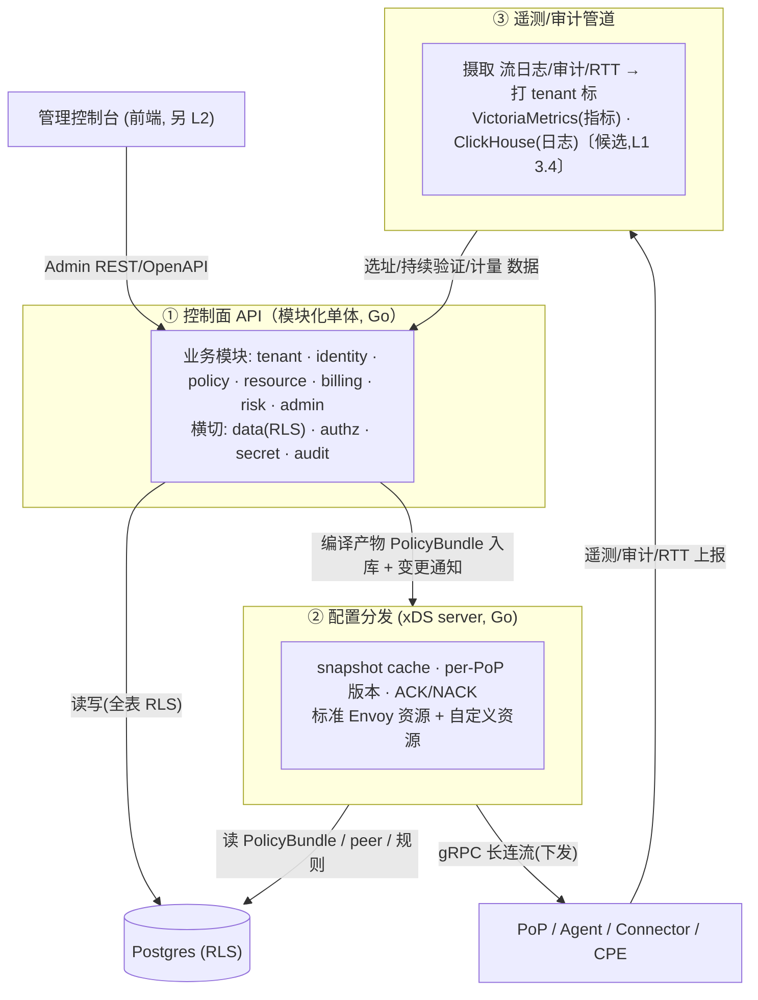

# 控制面 L2 组件软件架构 · 总览

> **状态:** L2 组件设计 / 总览 / 待评审
> **版本:** v0.1
> **日期:** 2026-05-24
> **设计者:** 花刚 <ghua@ikuai8.com>
>
> **层级:** 本文档是 **L2(组件内部软件架构)**,对象为**服务端控制面**。上承 L1 系统架构 `sase-architecture-design.md`(现 v0.6,业务模块已增至 7,加 `risk`)的 3.4(控制面三单元)、3.3(数据模型)、3.1(xDS)、3.2(多租户隔离)、3.8(信任/风险引擎)、3.11(API 契约)、3.16(租户生命周期)、3.17(计费)、3.18(RBAC)。
>
> **范围(本次=总览先行):** 定三单元的内部边界与交互、模块化单体的模块分解与边界规则、Go 包结构骨架、关键机制点名(策略编译 / RLS 上下文 / xDS 快照 / IdP 适配 / 计量)。**各机制的深挖留后续子 L2 文档(见五)。** 本文档不深入单个机制的完整规格。
>
> **不涉及:** 客户端(Agent/Connector/CPE)、前端控制台、PoP 单机编排(各为独立 L2);国密加密栈(待 PoC-G,不影响控制面 L2)。
>
> **仍守设计先行:** 只设计内部分层/包结构/机制,**不写实际代码、不搭脚手架**(包结构是设计产物,非代码)。每个决策配依据 / 备选及落选 / 可行方案;未定项标「待确认 / 待 L2 深挖」,不编造。

---

## 目录

- 一、背景
- 二、目标
- 三、设计
  - 3.1 三单元边界与交互
  - 3.2 模块化单体:模块分解
  - 3.3 模块边界规则(微服务拆分预留)
  - 3.4 关键机制点名
  - 3.5 Go 包结构骨架
  - 3.6 内部契约
- 四、风险
- 五、结论与后续子 L2 分解
- 附录:待确认 / 待 L2 深挖清单

---

## 一、背景

L1 的 3.4 定了控制面的**外部边界**:三个发布单元——**① 控制面 API(模块化单体,Go)、② 配置分发(xDS server,Go)、③ 遥测/审计管道**——及各自职责、存储、为何独立。但 L1 不涉及单元内部:模块如何分解、模块间走什么契约、包怎么组织、关键机制(策略编译、RLS 上下文、xDS 快照)落在哪。这些是 L2 的内容,也是搭 Go monorepo 前必须先定的。

**为什么现在做(不等国密 PoC-G):** 国密选型(`sase-gm-crypto-selection.md`)只影响**客户端/PoP 加密栈**;控制面不在加密热路径,其模块分解、数据访问、策略编译、xDS 分发逻辑与隧道算法无关。故控制面 L2 可独立于国密 PoC 推进(L1 5.2 / R7 的依赖关系已界定)。

**为什么先做总览:** 控制面三单元 + 十余模块,一次深挖过大且易返工。先立骨架(边界 + 包结构 + 机制点名),确认结构后再逐机制深挖,降低返工面。

---

## 二、目标

1. 给三单元的**内部架构总览**:单元间交互、单元内模块分解。
2. 定**模块边界规则**,使「起步模块化单体、后续可拆微服务」(L1 3.4)有明确的拆分线,而非泛泛承诺。
3. 给 **Go 包结构骨架**(设计层,非脚手架),作为后续搭 monorepo 的蓝图。
4. **点名关键机制**并指向后续子 L2,不在总览里深挖。
5. 守 L1 约束:模块化单体起步(不过度微服务化,3.4)、策略编写态/执行态分离(3.3)、RLS 强制(3.2)、秘密只存 KMS 引用(3.5)。

**非目标:** 库级选型(HTTP 路由 / ORM / 迁移工具)留各机制深挖时定,本总览只标决策点;不写 proto/OpenAPI 完整定义(L1 3.11 已定契约方向,细化属后续);不涉及部署拓扑(L1 3.13)。

---

## 三、设计

### 3.1 三单元边界与交互

**背景** L1 定了三单元各自职责,未画单元间的数据流与内部接口。

**目标** 明确三单元如何协作、交接物是什么,避免单元职责蔓延。

**设计**



**单元间交接物(契约,非实现):**
- **API 单体 → xDS server:** 交接物是 **`PolicyBundle`(编译产物,L1 3.3,带版本)** + 其他执行态资源(WG peer、eBPF 规则、吊销表、租户路由域),**经 `data` 层落库(规则 3)+ 变更通知**。依据:执行态/编写态分离(L1 3.3),xDS server **只搬运不编译**,不依赖业务逻辑 → 单元解耦,可独立扩缩。
  - 备选:API 单体直接经内部 gRPC 推给 xDS server(不落库)。落选理由:xDS server 须重启恢复时无源可读(fail-static 缓存仍需持久来源);落库使 xDS server 无状态可水平扩展。
  - 通知机制:Postgres `LISTEN/NOTIFY` 或内部 gRPC 通知,**待 L2 深挖(xDS 子文档)**。
- **遥测管道 → API 单体:** 选址(L1 3.13)、持续验证(3.8)、计量(3.17)所需的聚合数据,经查询接口回流。
- **管理控制台 → API 单体:** Admin REST + OpenAPI(L1 3.11),前端为独立 L2。

**风险** 三单元经 Postgres 交接产生隐式耦合(schema 即契约)→ 交接表(PolicyBundle 等)的结构纳入版本化契约,变更走迁移 + 兼容策略(3.6)。

**结论** 三单元经**持久化交接物 + 变更通知**协作,xDS server 与遥测管道对 API 单体的业务逻辑无依赖;交接物结构是受版本管理的内部契约。

---

### 3.2 模块化单体:模块分解

**背景** L1 定 API 单体为模块化单体,但未给模块清单。模块划分是后续一切的基础,也是未来微服务拆分线。

**目标** 给出业务模块、横切层、平台级模块清单,各自职责与对应 L1 数据实体。

**设计 —— 模块清单(Go package 即模块边界)**

| 类别 | 模块 | 职责 | 对应 L1 实体(3.3) |
|------|------|------|-------------------|
| 业务 | `tenant` | 租户 CRUD、生命周期(开通/停用/注销,3.16)、配额 | Tenant, Quota |
| 业务 | `identity` | IdP 配置与适配器、用户/组、SCIM 同步、令牌交换(自签短 TTL) | IdPConfig, User, Group |
| 业务 | `policy` | 策略编写(CRUD)、**策略编译器**(→ PolicyBundle)、版本/回滚 | Policy, PolicyBundle |
| 业务 | `resource` | 应用、连接器组/连接器、站点/CPE 的注册与管理(承接 enroll/ZTP,3.11) | Application, ConnectorGroup, Connector, Site, CPE, Device |
| 业务 | `billing` | 用量聚合、计费模型(席位 + 带宽超量,3.17)、活跃口径(C8) | UsageRecord |
| 业务 | `risk` | 信任/风险引擎:加权评分(姿态 + DLP 等信号)、动态访问控制(升 critical→自适应撤销、风险进凭证 claim)(L1 3.8,`sase-l2-cp-trust-risk-engine.md`) | (消费 Device.posture / DLP finding;非新增持久实体,起步内存态) |
| 业务 | `admin` | Admin REST API 编排、RBAC(平台/租户双角色,3.18) | (跨模块,写 AuditLog) |
| 横切 | `data` | Postgres 访问、**RLS 上下文注入**、事务、迁移 | (全部) |
| 横切 | `authz` | RBAC 强制、租户作用域校验 | — |
| 横切 | `secret` | KMS 引用解析(secret_ref→KMS)、信封加密 DEK/KEK(3.5) | (IdPConfig.secret_ref 等) |
| 横切 | `audit` | append-only 审计写入(防篡改,3.14) | AuditLog |
| 平台级 | `platform` | PoP 注册、容量、选址数据(消费遥测);平台运维控制台后端 | PoP(非租户作用域) |

依据:模块按 **L1 3.3 实体聚合 + 3.4 职责** 切,与数据模型对齐。`admin` 单列因它是 API 编排 + RBAC 入口,跨多业务模块。

备选与落选:
- **按技术分层(controller/service/dao)**:改一个业务要横跨三层散弹式修改,且层间无业务边界、无法映射微服务 → 落选。
- **按 DDD 限界上下文(更细领域聚合)**:对当前规模(起步模块化单体,L1 3.4)过度设计,聚合过细增协调成本 → 落选;但本切法的模块即粗粒度限界上下文,后续可在模块内细化(如 `resource` 拆分,见下风险)。

**风险** `resource` 模块聚合实体较多(应用/连接器/站点/CPE)→ 若膨胀,后续可沿 ZTNA 资源(应用/连接器)与 SD-WAN 资源(站点/CPE)再拆;本总览先合,边界规则(3.3)保证可拆。

**结论** 7 业务模块 + 4 横切层 + 1 平台级模块;按 L1 实体/职责切;`resource` 留后续可拆点。(`risk` 为 2026-05 新增第 7 业务模块,L1 3.8 持续自适应风险评估的控制面落点,见 `sase-l2-cp-trust-risk-engine.md`。)

---

### 3.3 模块边界规则(微服务拆分预留)

**背景** L1 3.4 承诺「起步模块化单体、后续可拆微服务,依赖现在的模块边界 + 依赖检查」。这条承诺要靠具体规则兑现,否则模块化单体会退化成大泥球。

**目标** 定可机械校验的边界规则,使每个业务模块都是潜在的独立服务。

**设计 —— 四条规则**

1. **模块间只经显式接口调用,禁直接访问对方数据。** 每业务模块对外暴露一个 Go interface(如 `tenant.Service`),其他模块依赖接口、不 import 对方内部包、不读对方的库表。依据:这是"可拆分"的充要条件——拆服务时把接口换成 gRPC stub 即可。
2. **依赖方向单向、无环,CI 强制。** `admin` → 业务模块 → 横切层(`data`/`authz`/`secret`/`audit`),不反向、不横向乱依赖。用依赖检查工具(候选 `depguard` / `go-arch-lint`,**待 L2 深挖定**)在 CI 拦截违规 import。
3. **数据访问统一经 `data` 层 + 强制 RLS 上下文。** 任何模块不得绕过 `data` 直连 Postgres;`data` 层保证每事务注入 `app.current_tenant`(见本文 3.4 RLS 多租户上下文)。依据:L1 3.2 "新增表漏配 RLS → 构建失败" 的落点。
4. **编写态与执行态隔离。** `policy` 模块内,编写态(Policy CRUD)与编译器(→ PolicyBundle)分属不同子包;编译器无副作用、可单测(对接 L1 3.20 策略测试)。

**风险** 规则靠约定易腐化 → 全部规则做成 CI 门禁(依赖检查 + RLS 检查 + 接口约束),非靠 review 自觉(对接 L1 3.20)。

**结论** 四条可机械校验的边界规则(接口隔离 / 依赖无环 / 统一数据层 / 编写执行隔离),把"可拆微服务"从承诺变成门禁。

---

### 3.4 关键机制点名

**背景** 控制面有几处机制是正确性/性能命门,总览先点名 + 定位,深挖留子 L2。

**目标** 列出关键机制、它在哪个模块、核心约束、指向的后续子 L2,**不在此给完整规格**。

**设计 —— 机制清单**

| 机制 | 所在 | 核心约束(L1 来源) | 深挖去向 |
|------|------|------------------|---------|
| **策略编译管线** 编写→编译→下发 | `policy` | Policy → PolicyBundle(带版本)→ 拆为 L3/L4(eBPF map)+ L7(Envoy ext_authz 配置)+ 自定义资源;**热路径无解释器**(3.4);编译错误=安全漏洞→CI 强制测试(3.20) | 子 L2:策略编译器 |
| **RLS 多租户上下文** | `data` | 每请求/事务 `SET app.current_tenant`;连接池归还**必须重置**;平台级表(PoP)不受 RLS(3.2) | 子 L2:数据访问层 |
| **xDS 快照与下发** | 单元 ② | go-control-plane snapshot cache;per-PoP 版本;标准 Envoy 资源 + 自定义资源类型(WG peer/eBPF 规则/吊销表/租户路由域);ACK/NACK;fail-static(3.1) | 子 L2:xDS server |
| **IdP 适配** | `identity` | adapter 接口统一标准(OIDC/SAML/SCIM)+ 企微/钉钉/飞书;IdP 认证后**换发自签短 TTL 凭证**,不透传 IdP 长令牌(3.4) | 子 L2:身份与 IdP |
| **快速失效通道** | `policy`/`identity` → ② | 撤销不等控制面恢复;短 TTL 凭证 + 吊销表经 xDS 推送(3.1/3.5) | 子 L2:xDS server |
| **计量聚合** | `billing` | PoP 计量 → 遥测聚合 → UsageRecord;席位(月内有会话,C8)+ 带宽超量(C9);多点核对防篡改(3.17) | 子 L2:计费计量 |

**风险** 机制点名若与后续深挖脱节 → 每个机制在子 L2 文档回引本表,保证总览与深挖一致。

**结论** 六处关键机制已点名定位;深挖在对应子 L2,本总览只锁"在哪、约束是什么、去哪深挖"。

---

### 3.5 Go 包结构骨架

**背景** 模块分解(3.2)与边界规则(3.3)需落到具体目录,作为搭 monorepo 的蓝图。

**目标** 给 monorepo 包布局骨架(设计,非脚手架),体现单元划分与模块边界。

**设计 —— 布局骨架**

```
sase/                      # Go monorepo
  cmd/
    api-server/            # 单元① 模块化单体 入口
    xds-server/            # 单元② 配置分发 入口
    telemetry/             # 单元③ 遥测/审计管道 入口
  internal/
    tenant/                # 业务模块(每个含 service.go 接口 + 内部子包)
    identity/
    policy/
      authoring/           # 编写态(CRUD)
      compiler/            # 执行态(→ PolicyBundle),无副作用、可单测
    resource/
    billing/
    admin/                 # REST API 编排 + RBAC 入口
    platform/              # 平台级(PoP/容量)
    data/                  # 横切:Postgres + RLS 上下文 + 迁移
    authz/                 # 横切:RBAC 强制
    secret/                # 横切:KMS 引用 + 信封加密
    audit/                 # 横切:append-only 审计
    xds/                   # 单元② 内部:snapshot/资源构建(被 cmd/xds-server 用;非 API 单体模块,不计入 3.2)
    telemetry/             # 单元③ 内部(非 API 单体模块,不计入 3.2)
  pkg/                     # 可被外部(客户端等)复用的稳定库(谨慎放)
  api/
    openapi/               # Admin REST 契约(单一来源,3.11)
    proto/                 # 内部 gRPC + xDS 自定义资源(单一来源,3.11)
  migrations/              # schema 迁移(含 RLS 检查)
```

依据:`cmd/` 分三入口对应三发布单元;`internal/` 放模块(Go `internal` 机制天然阻止外部 import,强化 3.3 边界);`api/` 放契约单一来源(L1 3.11 "proto/OpenAPI 为单一来源");`policy` 内分 `authoring`/`compiler` 落实编写/执行隔离(规则 4)。
- 备选:按单元分顶层目录(`api/`、`xds/`、`telemetry/` 各自 monorepo)。落选理由:三单元共享数据模型、契约、横切层,分仓导致共享代码复制或跨仓依赖;monorepo + 模块边界门禁更适配「地基统一」。
- **待确认:** 是否引入 `pkg/` 暴露给客户端复用(如共享 proto 生成代码)——倾向客户端经 `api/proto` 生成而非依赖 `pkg/`,**待客户端 L2 定**。

**风险** monorepo 易被绕过边界 import → 靠 `internal/` 机制 + 依赖检查门禁(3.3 规则 2)。

**结论** monorepo:`cmd/` 三入口 + `internal/` 模块 + `api/` 契约单一来源 + `migrations/`;`internal/` 机制 + 门禁守边界。

---

### 3.6 内部契约

**背景** 模块间(Go 接口)、单元间(交接物)、对外(REST/gRPC)三层契约需口径统一。

**目标** 明确三层契约的形态与单一来源。

**设计**
- **模块间:** Go interface(`internal/<module>/service.go`),编译期校验;拆服务时映射为 gRPC(`api/proto`)。
- **单元间:** 交接物 schema(PolicyBundle 等执行态表)+ 变更通知;schema 变更走 `migrations/` + 向后兼容。
- **对外:** Admin REST 由 `api/openapi` 生成;内部 gRPC / xDS 资源由 `api/proto` 生成。**proto/OpenAPI 为单一来源,代码生成**(L1 3.11)。

**风险** 契约与实现漂移 → 生成代码 + CI 校验生成物与源一致(L1 3.11 风险的落点)。

**结论** 三层契约:模块间 Go 接口、单元间交接 schema、对外 proto/OpenAPI 单一来源生成;漂移靠生成 + CI 堵。

---

## 四、风险

### RC1:模块化单体退化为大泥球
边界靠约定会腐化 → 3.3 四条规则全做成 CI 门禁(依赖检查 + RLS 检查 + `internal` 机制);定期审依赖图。

### RC2:三单元经 Postgres 隐式耦合
交接表 schema 即契约,改动易波及 → 交接物 schema 纳入版本化契约,变更走迁移 + 兼容窗口(3.1/3.6)。

### RC3:总览与后续深挖脱节
点名机制(3.4)若深挖时跑偏 → 每个子 L2 回引 3.4 表;本总览定稿后作为子 L2 的约束基线。

### RC4:库级选型悬空影响深挖
路由/ORM/迁移/依赖检查工具未定 → 列入待确认(附录),在各机制子 L2 定,带依据/备选。

---

## 五、结论与后续子 L2 分解

**结论(总览级):** 控制面 = 三发布单元(API 单体 / xDS server / 遥测管道),经持久化交接物 + 通知解耦;API 单体内分 7 业务模块 + 4 横切层 + 1 平台级模块,按 L1 实体/职责切;四条可机械校验的边界规则把「可拆微服务」变成门禁;monorepo 包结构骨架 + 契约单一来源已定。**关键机制已点名定位,深挖见下分解。**

**后续子 L2 文档(按建议优先级,依赖控制面骨架本总览):**

| 子 L2 | 内容 | 优先级依据 |
|-------|------|-----------|
| 策略编译器 | Policy→PolicyBundle 编译、拆 xDS 资源、版本/回滚、编译测试 | 是控制面核心价值与正确性命门(3.4) |
| 数据访问层 + RLS | RLS 上下文注入、连接池重置、事务、迁移与 RLS 检查门禁 | 0 泄漏的工程落点(L1 3.2),其他模块都依赖 |
| xDS server | snapshot cache、per-PoP 版本、自定义资源、fail-static、通知机制 | 下发命脉;与 PoP L2 接口 |
| 身份与 IdP | adapter 接口、企微/钉钉/飞书、SCIM、令牌交换 | 开通即用,客群强依赖国产 IdP |
| 计费计量 | 聚合、口径、防篡改 | 收入相关,可稍后 |

**与编码的边界:** 以上仍是设计。搭 monorepo 脚手架 / 写代码须另行授权(守设计先行)。

---

## 附录:待确认 / 待 L2 深挖清单

| # | 项 | 性质 | 去向 |
|---|----|------|------|
| LC1 | HTTP 路由 / gRPC 框架库选型 | 库级选型 | 各机制子 L2 |
| LC2 | DB 访问方式(sqlc / ORM)与迁移工具 | 库级选型 | 数据访问层子 L2 |
| LC3 | 依赖检查工具(depguard / go-arch-lint) | 工具选型 | 数据访问层 / CI |
| LC4 | 单元间变更通知机制(LISTEN/NOTIFY vs 内部 gRPC) | 机制 | xDS server 子 L2 |
| LC5 | 是否引入 `pkg/` 暴露给客户端复用 | 边界 | 待客户端 L2 |
| LC6 | `resource` 模块是否按 ZTNA/SD-WAN 再拆 | 模块边界 | 视膨胀程度,后续 |

> 说明:本总览为控制面 L2 的骨架与基线;库级/工具级选型与各机制完整规格在对应子 L2 文档定,均带依据/备选。控制面 L2 不依赖国密 PoC-G。
