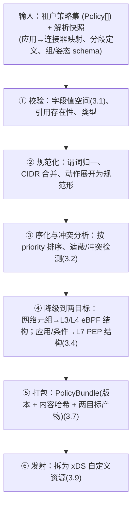

# 控制面 L2 子文档 · 策略编译器

> **状态:** L2 组件设计 / 机制深挖 / 待评审
> **版本:** v0.1
> **日期:** 2026-05-24
> **设计者:** 花刚 <ghua@ikuai8.com>
>
> **层级与上承:** L2 子文档,深挖**控制面** `policy` 模块的**编译器**(编写态 → 执行态)。上承控制面 L2 总览 `sase-l2-control-plane-overview.md` 的 3.2(`policy` 模块含编写 + 编译器)、3.3 规则 4(编写态/执行态隔离)、3.5(`authoring`/`compiler` 子包)、3.4(策略编译管线点名)、3.1(PolicyBundle 入库 + 通知交接);及 L1 `sase-architecture-design.md` v0.6 的 **3.4(策略引擎:编写→编译→下发→执行,热路径无解释器)**、3.3(`Policy`/`PolicyBundle` 模型)、3.10(安全栈,`inspect` 效果)、3.2(配额 `max_policies`)、3.20(策略测试)。衔接数据访问层子 L2 `sase-l2-cp-data-access-rls.md`(PolicyBundle 经 `data` 层 `InTx` 落库)。
>
> **为什么深挖它:** 策略引擎是控制面核心价值;L1 把"编译错误 = 安全漏洞"列为风险。编译器的正确性与 fail-closed 直接决定 ZTNA"消除横向移动"和 FWaaS 分段是否成立。
>
> **范围:** 策略模型完整规格、求值语义(默认拒绝/优先级/冲突)、编译管线阶段、两级编译目标(eBPF / L7 PEP bundle)、热路径无解释器的具体含义、条件的编译期/运行期分层、版本化/原子/回滚/幂等、全量 vs 增量、下发拆分到 xDS、编译测试。
>
> **不含(明确边界):** **PEP 在 PoP 上对编译产物的求值实现**(属 PoP 单机编排 L2,部分待 PoC-1);eBPF map / Envoy 资源的**具体字节级 schema**(随 PoP L2 与 xDS 契约细化);安全栈各能力(SWG/FWaaS/DLP)引擎内部(各自子 L2)。**本文定"编译产物的逻辑结构与语义契约",不定 PoP 侧如何执行它。**
>
> **设计先行:** 含逻辑结构与语义说明,**不写编译器代码、不搭脚手架**。每个决策配依据 / 备选及落选 / 可行方案;未定项标「待确认 / 待 PoP L2」。

---

## 目录

- 一、背景
- 二、目标
- 三、设计
  - 3.1 策略模型(编写态)完整规格
  - 3.2 求值语义:默认拒绝 + 优先级 + 冲突处理
  - 3.3 编译管线阶段
  - 3.4 两级编译目标(L3/L4 eBPF · L7 PEP bundle)
  - 3.5 "热路径无解释器"的具体含义
  - 3.6 条件分层:编译期定死 vs 运行期求值
  - 3.7 版本化、原子性、回滚、幂等
  - 3.8 全量 vs 增量编译
  - 3.9 下发拆分到 xDS(交接契约)
  - 3.10 编译测试框架
- 四、风险
- 五、结论与衔接
- 附录:待确认 / 待 PoP L2

---

## 一、背景

L1 3.4 定了策略引擎四阶段「编写→编译→下发→执行」与统一模型 `主体 × 资源 × 动作 × 条件 → 效果`,并要求**热路径无解释器**(每包跑解释器不可接受)、**两级执行**(L3/L4 进 eBPF map,L7 经 Envoy `ext_authz` 调 PEP)、**版本化可回滚**。总览把编译归入 `policy.compiler`(无副作用、可单测),并定 PolicyBundle 为单元间交接物。但"编译具体做什么、产物长什么样、怎么保证编译不引入越权"尚未定义。

本文回答:**"编译"把租户策略变成什么,使数据面既快(无解释器)又对(fail-closed、可测)。** 这是 ZTNA/FWaaS 安全语义能否成立的工程根基。

---

## 二、目标(可衡量)

1. **完整策略模型**:`Policy`(L1 3.3)各字段值空间明确,租户管理员可表达 ZTNA 应用授权与 FWaaS 分段。
2. **确定的求值语义**:默认拒绝;优先级与冲突处理规则唯一、可预测、可分析(无歧义)。
3. **两级编译产物规格**:L3/L4 → eBPF 查表结构;L7 → PEP 决策结构。二者均为**查表/有界求值**,无 AST 解释(兑现 L1 "热路径无解释器")。
4. **编译 fail-closed 且原子**:编译失败不产出半成品 bundle;不存在"编译出错却开放了访问"的状态(L1 "编译错误=安全漏洞")。
5. **版本化/回滚/幂等**:PolicyBundle 单调版本 + 内容寻址;回滚=激活上一版;同输入幂等不重复下发。
6. **可测**:给定 `主体+资源+上下文 → 期望效果` 的 golden 测试 + 属性测试,CI 强制(L1 3.20)。
7. **纯函数编译器**:无副作用,输入(策略集 + 解析所需的快照)→ 输出(PolicyBundle),可重放可单测(总览 3.2)。

**非目标:** PoP 侧 PEP 求值实现(PoP L2);eBPF/Envoy 字节级 schema(契约细化);条件中"风险分""设备姿态"的**采集**(来自 Agent/遥测,L1 3.8/3.14,本文只消费其在求值期的取值)。

---

## 三、设计

### 3.1 策略模型(编写态)完整规格

**背景** L1 3.3 给了 `Policy` 字段名,未给值空间。编译器的输入边界需先定清。

**目标** 明确每字段的取值与语义,确立"主体不在编译期展开为具体用户"。

**设计 —— `Policy` 字段规格**

| 字段 | 取值空间 | 语义 |
|------|---------|------|
| `subject` | user / group / device-posture **选择器**(非具体用户列表) | 谁。**保持为选择器**(组 id、姿态谓词),求值期由 PEP 用请求身份匹配 |
| `resource` | ZTNA 应用(app_id/FQDN/overlay) 或 网络分段(segment/CIDR/port) | 对什么 |
| `action` | 访问动作(connect / http-method 等,按资源类型) | 做什么 |
| `condition` | time / geo / risk 谓词(jsonb,**严格对齐 L1 3.3**) | 何种上下文下。**posture 不在此**——设备姿态由 `subject` 的 device-posture 选择器表达、以 `Device.posture`(L1 3.3)为输入 |
| `effect` | `allow` / `deny` / `inspect`(L1 3.3/3.10) | 结果;`inspect`=放行但导入安全栈(SWG/DLP) |
| `priority` | 整数(小=高优先) | 求值顺序(见 3.2) |

**关键决策:`subject` 不在编译期展开为具体用户。** 依据:用户/组成员频繁变动且量大(单租户 ≥5000 用户,L1 2.2),展开会使 bundle 爆炸且每次成员变动都要重编译;保持选择器,由 PEP 在求值期用短 TTL 凭证里的身份/组/姿态声明匹配(L1 3.8 凭证)。
- 备选:编译期把 group 展开成 user 列表。落选:bundle 随成员数爆炸、成员变动即全量重编译、与"凭证携带身份"重复。
- 可行:`identity` 模块保证凭证含 group_ids/posture(L1 3.4 令牌交换);编译器只需 group id,不查成员。

**风险** 选择器语义与凭证声明不一致致误判 → 选择器取值与凭证 schema 同源(契约,3.9);姿态/风险谓词的取值范围需与 Agent 上报对齐(附录)。

**结论** `Policy` 六字段值空间已定;`subject` 保持选择器、不展开,求值期匹配凭证声明——避免 bundle 爆炸与频繁重编译。

---

### 3.2 求值语义:默认拒绝 + 优先级 + 冲突处理

**背景** 多条策略可能同时匹配一次访问,必须有唯一、可预测的裁决规则,否则安全语义不可分析。

**目标** 定唯一裁决语义,既默认安全又能表达例外。

**设计 —— 三条规则**
1. **默认拒绝(default-deny):** 无任何规则匹配 → 拒绝。依据:零信任与 ZTNA "消除横向移动"(L1 3.8)的前提是默认不可达。
2. **显式优先级 + 优先级序内首次匹配(first-match in priority order):** 规则按 `priority` 升序求值,**第一条匹配的规则的 `effect` 即裁决**。依据:可表达"高优先级具体 `allow` + 低优先级宽 `deny`"这类例外;顺序由显式 `priority` 决定(非插入顺序),可预测、与有序 ACL / 防火墙规则链(如 iptables 链)的求值心智一致。
3. **编译期冲突/遮蔽检测:** 编译器静态分析出**被完全遮蔽的规则**(永不会被命中)与**同优先级同匹配集但效果冲突**的规则,产出**告警**(不静默);严重冲突(同优先级、匹配重叠、效果相反)可配置为**编译失败**。依据:让"写错策略"在编译期暴露,而非上线后才发现(L1 "编译错误=安全漏洞")。

- 备选:**deny-overrides**(任一 deny 即拒绝,忽略优先级)。落选:无法表达例外 `allow`(如"默认拒绝某段,但放行其中一台跳板机")。
- 备选:**allow-overrides**。落选:不安全,违背默认拒绝。
- 备选:**插入顺序首次匹配**(无显式 priority)。落选:顺序隐式、增删策略易引入意外遮蔽,不可预测。

**风险** first-match 的顺序敏感性 → 用显式 `priority` + 冲突/遮蔽检测(规则 3)管控;租户管理员误设优先级 → 控制台可视化求值顺序与遮蔽告警(前端 L2)。

**结论** 默认拒绝 + 显式优先级序内首次匹配 + 编译期冲突/遮蔽检测;既默认安全、可表达例外,又可静态分析。

---

### 3.3 编译管线阶段

**背景** 编译要把编写态策略变成两级执行产物,需分阶段以便各阶段可测、错误可定位。

**目标** 定义编译的有序阶段与各阶段产物,确立纯函数边界。

**设计 —— 阶段(纯函数:策略集 + 解析快照 → PolicyBundle)**

- **原子性:** 任一阶段失败 → **整体失败,不产出 bundle**(3.7 fail-closed)。无"部分编译成功"。
- **纯函数:** 不写库、不调外部服务;"解析快照"(应用/连接器/分段/schema)作为**输入显式传入**(由 `policy` 模块在编译前从 `data` 层取),使编译器可重放、可单测(总览 3.2、L1 3.20)。
- **错误定位:** 各阶段错误带策略 id / 字段路径,回传编写态供租户管理员修正。

依据:分阶段使校验/规范化/冲突/降级各自可测;纯函数 + 显式快照输入是可重放测试的前提。
- 备选:编译器内部直接查库取应用/分段。落选:有副作用、不可重放、测试需真库,违背总览 3.2"无副作用可单测"。

**风险** 解析快照与编译不在同一事务致漂移 → 编译输入快照带版本,与 bundle 一并记录(可追溯);阶段间数据结构耦合 → 各阶段定明确中间表示(IR),阶段独立测试。

**结论** 六阶段纯函数管线(校验→规范化→序化冲突→降级→打包→发射),整体原子、可重放、错误可定位;解析快照显式输入。

---

### 3.4 两级编译目标(L3/L4 eBPF · L7 PEP bundle)

**背景** L1 3.4 定两级执行。编译"降级"阶段(3.3 ④)要把策略分别落到两种目标结构。

**目标** 明确每级目标的逻辑结构与承载的策略子集。

**设计**

**L3/L4 目标(FWaaS 网络分段)→ eBPF 查表结构(逻辑)**
- 承载:纯网络维度规则——源/目的分段(CIDR)、端口、协议、效果(allow/deny)。每租户独立、按租户路由域键控(L1 3.2)。
- 逻辑结构:**LPM trie(最长前缀匹配,CIDR)+ 元组哈希表**,键为 `(租户域, 源, 目的, 端口/协议)`,值为效果。求值 = O(查表),无规则遍历解释。
- 不承载:依赖用户身份/姿态/时间的规则(这些进 L7)。

**L7 目标(ZTNA 应用访问 + 条件)→ PEP 决策结构(逻辑)**
- 承载:按应用授权 + subject 选择器 + 条件 + 效果(allow/deny/inspect)。
- 逻辑结构:**按 `resource`(应用)预索引** → 每应用挂一组**已按 priority 排序的规则**,每规则含编译后的 subject 匹配器与条件谓词(3.6)。求值 = 定位应用(哈希)→ 顺序匹配有界规则集(数量受 `max_policies` 配额上界,L1 3.2),取首次匹配(3.2)。**非 AST 解释**(3.5)。
- `inspect` 效果:产物标注"放行 + 导入安全栈",PoP 据此把流量送 SWG/DLP(L1 3.10)。

**字节级 schema:** 上述为**逻辑结构**;eBPF map 布局、PEP bundle 的具体编码(protobuf/flatbuffers 等)是**控制面↔PoP 契约**,随 xDS 契约与 PoP L2 细化(附录),本文只定逻辑语义。

依据:网络维度静态可查表(eBPF 内核态最快),身份/条件维度需请求上下文(L7 PEP);分层与 L1 两级执行一致。

**风险** 某规则跨两级(既限网络又限身份)→ 拆成 L3/L4 粗过滤 + L7 精判,语义以 L7 为准、L3/L4 不放宽;两级裁决不一致 → 默认拒绝兜底 + 编译期一致性检查(附录)。

**结论** L3/L4→eBPF 查表(LPM+哈希,网络维度),L7→PEP 预索引有界规则集(身份/条件维度);均查表/有界求值;字节级 schema 留契约细化。

---

### 3.5 "热路径无解释器"的具体含义

**背景** L1 反复强调热路径无解释器,但未界定"解释器"指什么。需给可验收的定义,否则易被违反。

**目标** 给"无解释器"的操作性定义,作为 PoP 侧执行的约束契约。

**设计 —— 定义:数据面每包/每请求的策略求值,只允许「查表 + 有界次数的谓词比较」,不允许「遍历解释策略 AST / 动态编译 / 正则回溯等无界操作」。**
- L3/L4:每包 = eBPF map 查表(O(1)/LPM),无遍历。
- L7:每请求 = 应用定位(哈希)+ 该应用有界规则集顺序匹配(上界 = 该应用规则数 ≤ 配额),每规则的 subject/条件是**预编译的谓词**(布尔短路),非解释表达式树。
- 编译期承担所有"展开/归一/排序/索引"工作(3.3),使运行期只做查表与比较。

依据:把可变工作量前移到编译期(每租户偶发),运行期为有界查表(每包/每请求高频)——这正是"编译"的价值,也是 10Gbps/低延迟预算(L1 2.2/3.19)的前提。
- 备选:运行期解释策略(灵活)。落选:每包解释不可接受(L1 3.4),延迟与吞吐不可控。

**风险** PoP 侧实现可能图省事内嵌解释器 → 本定义作为 PoP L2 的**契约约束** + 性能测试门禁(求值耗时上界,对接 L1 3.19/3.20);条件含正则(如 URL 匹配)→ 限定为线性时间匹配引擎、禁回溯(附录)。

**结论** "无解释器"= 运行期只查表 + 有界谓词比较;可变工作前移编译期;作为 PoP L2 契约约束 + 性能门禁,正则限线性引擎。

---

### 3.6 条件分层:编译期定死 vs 运行期求值

**背景** 求值所依赖的维度——`condition` 的 time/geo/risk,加上 `subject` 的 device-posture 选择器——有的能编译期定死,有的必须请求期才知道。混淆会导致要么不安全要么编进 eBPF 失败。

**目标** 定哪些维度编译期处理、哪些运行期求值,及编译器如何表示运行期维度。

**设计 —— 分层**(下表"posture"属 `subject` 选择器,其余属 `condition`,见 3.1)

| 维度 | 何时确定 | 处理 |
|------|---------|------|
| 网络元组(源/目的/端口/协议) | 编译期静态 | 降到 L3/L4 eBPF(3.4) |
| time(时间窗,condition) | 运行期(当前时间) | 编译为 L7 谓词:时间窗常量 + 运行期比较当前时刻 |
| geo(客户端地理,condition) | 运行期 | 编译为谓词:地理集合 + 运行期取客户端地理比较 |
| risk(风险分,condition) | 运行期 | 编译为谓词:阈值 + 运行期取风险分比较 |
| posture(设备姿态,**subject 选择器**) | 运行期 | 编译为谓词:姿态要求 + 运行期取凭证/上报姿态(`Device.posture`)比较 |

**编译器对运行期条件的表示:** 编译成**带常量的预编译谓词**(如 `time ∈ [09:00,18:00]`、`risk ≤ 阈值`),运行期由 PEP 代入当前上下文做布尔比较(3.5 有界比较),**不在运行期解析条件文本**。
- 运行期上下文来源(本文只消费、不负责采集):time=PoP 时钟;geo=客户端 IP/上报;risk=遥测/姿态派生(L1 3.8/3.14);posture=短 TTL 凭证声明 + Agent 上报(L1 3.8)。

依据:只有纯网络元组编译期完全可知,其余依赖请求上下文必须运行期;但"条件的**结构与常量**"可编译期定死,运行期只代值比较——既安全又无解释。
- 备选:全部条件运行期解释。落选:违背无解释器(3.5)。
- 备选:把 time 等也想办法编进 eBPF。落选:eBPF 难表达时间窗/风险阈值的语义,且这些维度本就需请求上下文。

**风险** 运行期上下文取值口径(风险分范围、姿态字段)与 Agent/遥测不一致 → 取值 schema 同源(附录,与 L1 3.8 对齐);客户端 geo 可伪造 → geo 条件仅作辅助、不作唯一门禁(安全说明)。

**结论** 网络元组编译期→eBPF;time/geo/risk(condition)与 device-posture(subject 选择器)编译为带常量预编译谓词、运行期代值比较;不在运行期解析条件;取值 schema 与 Agent/遥测同源。

---

### 3.7 版本化、原子性、回滚、幂等

**背景** L1 3.3/3.4:PolicyBundle 带版本,回滚=推上一版。需定版本/原子/幂等的具体语义。

**目标** 定 bundle 的版本与内容寻址、激活原子性、回滚与幂等规则。

**设计**
- **版本 + 内容哈希:** 每次编译产 PolicyBundle。**沿用 L1 3.3 字段**(`id / tenant_id / version / compiled(bytea) / created_at / status(active/rolled_back)`),**本文新增 `content_hash`**(对 `compiled` 取哈希,用于幂等,3.7)。`content_hash` 为新增字段 → **已于 L1 v0.5 回写 L1 3.3 的 `PolicyBundle`(W1)**;`data` 层作对 `compiled` 的派生列实现。`status` 取值严格沿用 L1 的 `active/rolled_back`。
- **幂等:** 新编译若 `content_hash` 与当前激活版相同 → **不产新版、不下发**(避免无意义推送与 PoP 重载)。依据:策略未实质变化不应触发数据面扰动。
- **原子激活:** 一个租户在任一 PoP **同一时刻只有一个激活 bundle**;切换是原子的(PoP 收到新版 ack 后整体切换,不混用新旧规则)。依据:避免半新半旧导致的越权窗口。
- **回滚:** 激活上一 `version`(产物已存,无需重编译);回滚也是原子激活。
- **fail-closed 编译:** 编译失败 → 不产 bundle、**保持当前激活版不变**(不降级为"无策略=放行"——那将违背默认拒绝)。依据:L1 "编译错误=安全漏洞"——错误绝不能扩大访问。

依据:版本+内容寻址给幂等与回滚;原子激活消除新旧混用窗口;fail-closed 保证错误永不开放访问。

**风险** 多 PoP 激活不同步致短暂不一致 → 各 PoP 独立 ack、以 PoP 为单位原子切换,跨 PoP 最终一致(可接受,撤销另走快速失效通道,L1 3.1/3.5);版本号回绕/冲突 → 单调分配 + 持久化(`data` 层)。

**结论** PolicyBundle 版本 + 内容哈希;幂等跳过无变化;每 PoP 原子激活、回滚=激活旧版;编译失败 fail-closed 不动当前版,绝不因错误放行。

---

### 3.8 全量 vs 增量编译

**背景** 租户改一条策略,是重编整租户 bundle 还是增量更新?影响复杂度与正确性。

**目标** 在正确性优先下选定编译粒度。

**设计 —— 选全量(整租户重编)。**
- 依据:① 单租户策略规模有界(`max_policies` 配额,L1 3.2),全量编译成本可控;② 全量 + 内容哈希幂等(3.7)天然避免增量的"状态漂移/部分更新不一致";③ 冲突/遮蔽检测(3.2)本就需全集视图,增量难做全局分析;④ 全量产物易做 golden 测试(3.10)。
- 备选:增量编译(只重算受影响规则)。落选(起步):增量需维护规则间依赖与产物增量合并,易引入不一致,且全局冲突分析失效;收益(编译耗时)在配额规模下不显著。
- 可行的规模化逃生:若某租户策略量逼近配额上界使全量编译耗时成问题,再引入增量(届时配合依赖图);列为**待规模化优化**(附录),非起步必需。

**风险** 全量编译耗时随策略数线性增长 → 配额封顶 + 编译耗时监控(L1 3.14);高频改策略致频繁全量 → 编辑合并/防抖(短窗合并多次修改后编一次)。

**结论** 起步全量编译(配额有界、幂等、利于全局分析与测试);增量留规模化逃生;高频修改用防抖合并。

---

### 3.9 下发拆分到 xDS(交接契约)

**背景** 总览 3.1 定 PolicyBundle 入库 + 通知,xDS server 下发。编译产物如何拆成 xDS 资源、什么变什么不变,需定契约。

**目标** 明确编译产物→xDS 资源的拆分,界定与 xDS server 子 L2 的契约边界。

**设计**
- **编译产物拆为自定义 xDS 资源(L1 3.11,非标准 Envoy 资源):**
  - `L34RuleSet`(eBPF 结构,3.4)— 供 PoP-agent 写入 eBPF map。
  - `L7PolicyBundle`(PEP 决策结构,3.4)— 供 PoP 侧 PEP 加载。
  - 两者按 `tenant_id` 命名空间化,带 bundle `version`。
- **标准 Envoy 资源基本不随策略变:** Envoy 的 `ext_authz` 过滤器配置(指向本地 PEP)是**相对静态**的 listener/route 配置;策略变化体现在 PEP 加载的 `L7PolicyBundle`,而非 Envoy 自身配置。依据:避免每次改策略都重推 Envoy LDS/RDS,减少数据面扰动(对接 L1 3.7 共享 Envoy)。
- **交接路径:** `compiler` 产 bundle → `data` 层落库(`PolicyBundle` 表 + 拆分资源)→ 通知 xDS server(总览 3.1)→ xDS server 构快照、per-PoP 下发、收 ack(**机制属 xDS server 子 L2**)。
- **契约稳定性:** 资源 type URL、字段为受版本管理的契约(`api/proto`,总览 3.6),与 PoP L2 共享。

依据:把策略变化收敛到自定义资源、Envoy 静态化,既复用 xDS 传输(L1 3.1)又最小化数据面扰动;编译器只产逻辑产物,下发机制留 xDS 子 L2,职责清晰。

**风险** 自定义资源 schema 与 PoP 消费端漂移 → proto 单一来源 + 生成 + 契约测试(总览 3.6);bundle 过大致下发慢 → 配额封顶 + 仅变化租户下发(幂等,3.7)。

**结论** 编译产物拆为 `L34RuleSet` + `L7PolicyBundle` 两类自定义 xDS 资源(按租户+版本);Envoy 标准配置静态化;下发机制属 xDS 子 L2;schema 为 proto 单一来源契约。

---

### 3.10 编译测试框架

**背景** L1 3.20 要求"给定 主体+资源 → 期望效果"的策略测试,CI 强制。编译器是纯函数(3.3),天然可测。

**目标** 定测试类型与 CI 门禁,守编译正确性。

**设计 —— 测试类型**
1. **Golden 决策测试:** 给定 策略集 + 解析快照 + (主体, 资源, 上下文) → 断言裁决(allow/deny/inspect)符合预期。覆盖默认拒绝、优先级、例外、各条件(3.2/3.6)。
2. **冲突/遮蔽检测测试:** 构造遮蔽/冲突策略 → 断言编译器告警/失败(3.2 规则 3)。
3. **原子/fail-closed 测试:** 注入非法策略 → 断言编译整体失败、不产 bundle、当前激活版不变(3.7)。
4. **幂等测试:** 同输入两次编译 → 同 `content_hash`、第二次不产新版(3.7)。
5. **属性测试:** 随机合法策略集 → 断言不变量(无匹配必拒绝、deny 不被低优先 allow 覆盖到放宽、产物可被有界求值)。
6. **求值有界性测试:** 断言产物的求值步数有上界(对接 3.5 无解释器契约)。

落地:全部入 CI,**作为发布门禁**(L1 3.20 "策略测试 CI + 发布时强制")。
- 依据:纯函数编译器使决策测试可对编译产物直接验证,无需起 PoP;安全语义(默认拒绝/优先级/fail-closed)逐条有对应测试。

**风险** 测试用例覆盖不到的策略组合 → 属性测试补随机覆盖 + 真实租户策略回归集;golden 与语义实现同源偏差 → golden 期望由独立的语义参考(非编译器自身)给出。

**结论** 六类测试(golden/冲突/原子/幂等/属性/有界)入 CI 发布门禁;纯函数使决策可直接验证;安全语义逐条覆盖。

---

## 四、风险

### RP1:编译错误扩大访问(L1 "编译错误=安全漏洞")
最高危。缓解:原子编译、fail-closed(3.7)——失败不产 bundle、不动当前版、绝不退化为放行;原子测试(3.10 用例 3)。

### RP2:冲突/优先级误配致越权
缓解:默认拒绝(3.2 规则 1)+ 编译期冲突/遮蔽检测(规则 3)+ 控制台可视化求顺序(前端 L2)+ golden/冲突测试(3.10)。

### RP3:动态条件被误编进 eBPF 或运行期解析
缓解:条件分层表(3.6)+ 运行期条件编译为预编译谓词、不解析文本;求值有界性测试(3.10 用例 6)。

### RP4:编译产物与 PoP PEP 契约漂移
缓解:`L34RuleSet`/`L7PolicyBundle` proto 单一来源 + 生成 + 契约测试(3.9 / 总览 3.6);PEP 求值实现在 PoP L2 按此契约。

### RP5:全量编译耗时随规模增长
缓解:`max_policies` 配额封顶(L1 3.2)+ 编译耗时监控(L1 3.14)+ 高频修改防抖;规模化再上增量(3.8 逃生)。

### RP6:多 PoP 激活不一致窗口
缓解:每 PoP 原子激活 + 独立 ack(3.7);撤销实时性不依赖策略下发,走快速失效通道(L1 3.1/3.5)。

### RP7:subject 选择器与凭证声明 schema 不一致
缓解:选择器取值与 `identity` 凭证 schema 同源(3.1/3.6);契约测试覆盖(附录)。

---

## 五、结论与衔接

**结论:** 策略编译器是**纯函数六阶段管线**(校验→规范化→序化冲突→降级→打包→发射),把编写态 `Policy` 编译为两级执行产物——**L3/L4→eBPF 查表(网络维度)、L7→PEP 预索引有界规则集(身份/条件维度)**,运行期只查表 + 有界谓词比较(兑现 L1 "热路径无解释器")。求值语义为**默认拒绝 + 显式优先级序内首次匹配 + 编译期冲突/遮蔽检测**;`subject` 保持选择器不展开;求值维度按编译期(网络元组)/运行期(time/geo/risk 条件 + device-posture 选择器,预编译谓词)分层。产物为 **版本+内容哈希的 PolicyBundle**,幂等、每 PoP 原子激活、回滚=激活旧版、**编译失败 fail-closed 绝不放行**;起步**全量编译**(配额有界);拆为 `L34RuleSet`/`L7PolicyBundle` 两类自定义 xDS 资源下发;六类测试入 CI 发布门禁。

**衔接:**
- **xDS server 子 L2:** 消费本文的两类自定义资源,负责快照/per-PoP 版本/ack/fail-static(下发机制)。
- **PoP 单机编排 L2(部分待 PoC-1):** PEP 对 `L7PolicyBundle` 的求值、eBPF map 的写入是 PoP 侧实现,须遵守本文 3.5 "无解释器"契约与 3.4 逻辑语义。
- **数据访问层子 L2:** PolicyBundle 与拆分资源经 `data` 层 `InTx` 落库(已定)。
- **前端控制台 L2:** 策略编写、求值顺序与遮蔽告警可视化(RP2)。
- 与国密无关(不依赖 PoC-G)。

搭 monorepo / 写编译器代码须另行授权(设计先行)。

---

## 附录:待确认 / 待 PoP L2

| # | 项 | 性质 | 去向 |
|---|----|------|------|
| LP1 | `L34RuleSet` / `L7PolicyBundle` 的字节级 schema(protobuf/flatbuffers、字段布局) | 契约 | xDS 契约 + PoP L2 |
| LP2 | eBPF map 具体类型与键布局(LPM trie/hash 的 PoP 侧实现) | 实现 | PoP L2 |
| LP3 | PEP 对 L7 bundle 的求值算法与数据结构 | 实现 | PoP L2(守 3.5 契约) |
| LP4 | 条件取值 schema:风险分范围、姿态字段、geo 来源(是否信任客户端上报 geo / 仅用 PoP 侧 IP 归属) | 契约 | 与 L1 3.8/3.14 对齐,客户端/遥测子 L2 |
| LP5 | URL/正则类条件的匹配引擎(线性、禁回溯) | 选型 | 安全栈(SWG)子 L2 |
| LP6 | 严重冲突是"告警"还是"编译失败"的默认档与可配置项 | 策略 | 与租户配置/前端 L2 |
| LP7 | 增量编译(规模化逃生)的触发阈值与依赖图设计 | 优化 | 待规模化 |
| LP8 | 策略编辑防抖/合并窗口(短窗合并多次修改后编一次,3.8)与触发阈值 | 机制 | `policy.authoring` / 前端 L2 |

> 说明:本子 L2 定"编译产物的逻辑结构与语义契约"及编译器本身;PoP 侧执行(PEP 求值、eBPF 写入)属 PoP L2,须遵守本文 3.4/3.5 契约。不依赖国密 PoC-G。
